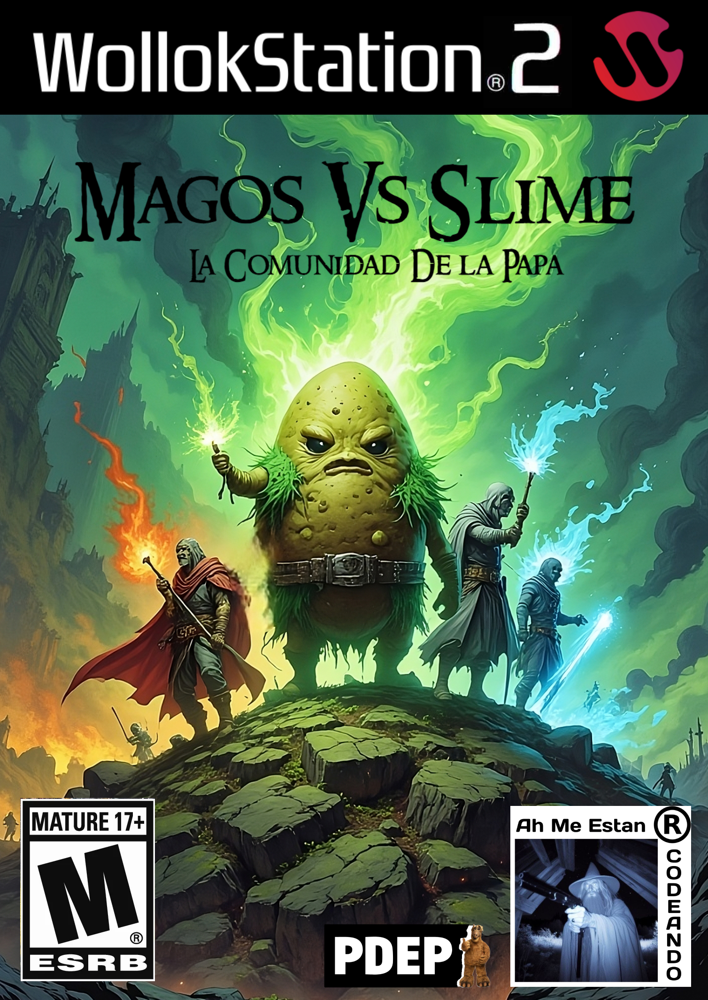
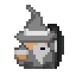
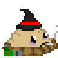
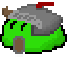
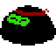

#  Magos Vs. Slimes
UTN - Facultad Regional Buenos Aires - Materia Paradigmas de Programación

Link al Trailer: https://youtu.be/0D9ru_qJyPM?si=un1xRSzEtPHEvkAe

Magos Vs Slimes es un videojuego de estrategia y defensa. El juego consiste en defender su la Base (Utopía de las Tierras de Nortfernand) de oleadas de diversos Slimes utilizando una variedad de Magos con poderes y funcionalidades únicas. Estos Magos deberán evitar que los Slimes lleguen a la base, en caso de que tres o más lo logren el juego finalizará y la humanidad perecerá. 

## Magos

 Cada Mago tiene una función específica, como disparar proyectiles, bloquear el avance de los zombis, explotar causando daño, entre otros. Los Magos requieren Dinero para poder ser contratados, este dinero se genera automaticamente a lo largo de la partida.

                    

  
 <pre>Daño:🔥🔥   Daño:❄️❄️❄️   Daño:🤑      Daño:☮️     Daño:💣💣💣  Daño:🤚 </pre>  

 <pre>Vida:❤️     Vida:💙       Vida:💚   Vida:🗿🗿🗿   Vida:☠️☠️☠️    Vida:❤️</pre>  
<pre>Dispara      Dispara    Genera Dinero    Proteccion    Inmola      Dispara </pre>  

## Proyectiles
 Cada Tipo de Proyectil tiene daño o efecto propio. Los proyectiles se pueden fusionar dando lugar a mas poderosos.
 
          
<pre>Daño:🔥🔥          Daño:❄️❄️❄️       Daño:🟣🟣🟣🟣      </pre>  

<pre>Daño:🤚 Relentiza Enemigos</pre>

## Slimes
Los Distintos Slimes tienen características propias, más vida, más daño, movimientos especiales, entre otras cosas. Estos atacarán en oleadas (desde el extremo derecho del tablero), e intentarán llegar a la base de los magos(extremo izquierdo del tablero).

             

<pre>
 Daño:🟢   |  Daño:🟢 | Daño:🥷🥷🥷| Daño:🛐🛐🛐| Daño: -    |  Daño:🟢 |   Daño:💣💣💣| Daño:🟢  
 Vida:💚💚| Vida:💚💚💚| Vida:💚💚|  Vida:🛐🛐🛐| Vida:💚💚💚| Vida:💚💚| Vida:💚💚💚| Vida:💚💚💚  
 Ataque Melee|Ataque Melee|Salta Magos| Ataque Melee| Da Dinero | Quita Dinero| Daño en Area| Salta entre Lineas
</pre>  

## Modos de Juego
<h3>Historia:</h3> Enfrentar diversos niveles con cambios en tipos y dificultad de Oleadas.
<h3>Eterno:</h3> Modo desafiante en el que se enfrentan oleadas interminables y aleatorias de Slimes, con dificultad Creciente.

## Controles:

- `A` para ir a la izquierda en la tienda
- `D` para ir a la derecha en la tienda
- `ARROW_UP` para mover arriba cursor
- `ARROW_LEFT` para mover izquierda cursor
- `ARROW_RIGHT` para mover derecha cursor
- `ARROW_DOWN` para mover abajo cursor
- `ENTER` para poner planta / utilizar pala
- `P` para reiniciar juego
- `I` termina el juego
- `O` para pausar juego
- `X` Ir al Menú Principal

  
## Equipo de desarrollo: 

- Echeverría, Manuel
- Marek, Nahuel
- Marzocca, Damián
- Schkurko, Nicolas
- Vallone, Matías
 

## Capturas 

Link al Lore: https://docs.google.com/document/d/1lBfEKnoyl5uwRfzc_BIOiNtRY3-iJxHwnHqUtpygSzU/edit?tab=t.0

Link al Trailer: https://youtu.be/0D9ru_qJyPM?si=un1xRSzEtPHEvkAe
