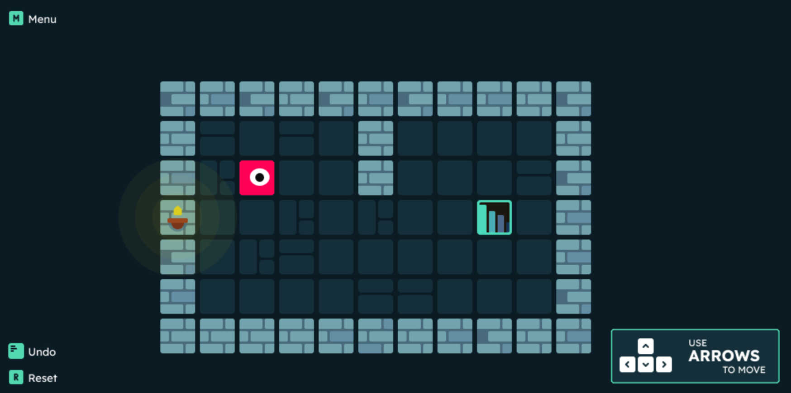
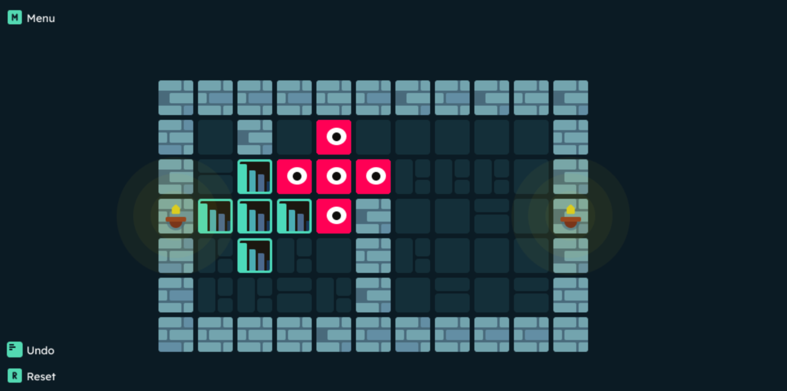
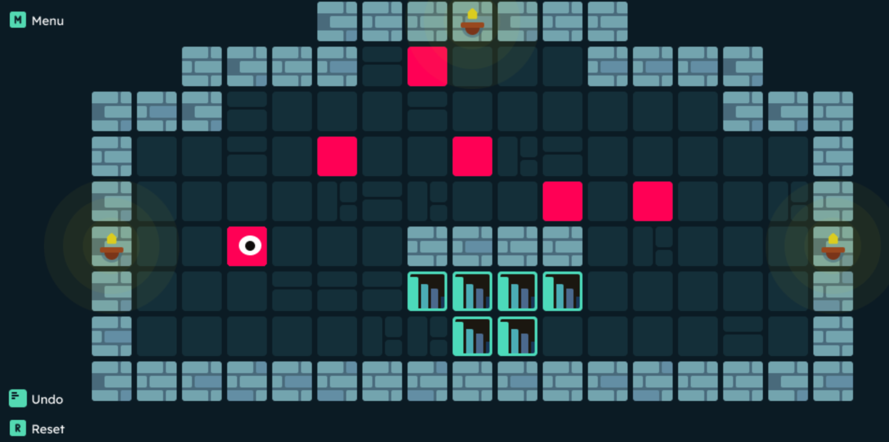
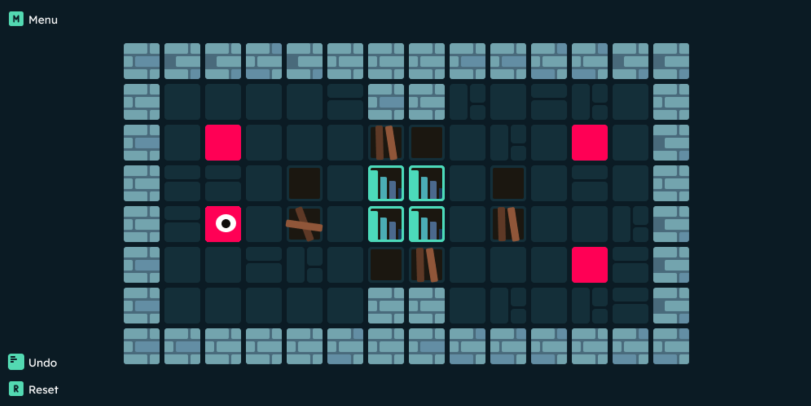

> UTN - Facultad Regional Buenos Aires - Materia Paradigmas de Programación

## Introducción

<h3 style = "font-weight:bolder">
¡Preparate para un quilombo de bloques en STICKY BLOCK!
</h3>

Acá no solo tenés que mover los bloques, ¡sino que cuando se pegan, te armás un lío bárbaro! 😜
Usá la cabeza para juntar los bloques mientras buscás la manera de llegar a la meta. 🧠

¿Te animás a resolver este embrollo o te quedás pegado? 🧩 **¡Dale que va! 🚀**

## Capturas

## Reglas de Juego / Instrucciones

### Instrucciones de *Sticky Block*

1. **Uní los bloques**: ¡Mové los *stickyblocks* y hacelos pegarse entre sí! Cuanto más pegajosos, mejor. 💥

2. **Esquivá los agujeros**: ⚠️Cuidado⚠️ En algunos niveles, ¡el piso tiene trampas! 🕳️

3. **Formá la figura**: Tenés que llegar a la meta, pero ojo, ¡la forma importa! Acomodalos como en el objetivo. 🎯

¡Dale que podés! 🚀

## Controles:

## Equipo de desarrollo:

- Devecchi Di Bella Lucas Nahuel
- Diez Forradellas Facundo
- Hernandez Mateo Nicolas
- Osa Pochelu Valentin Rodrigo
- Serrudo Jose Luis
  

[Conceptos teóricos aplicados en el TP](ConceptosTeoricos.md)