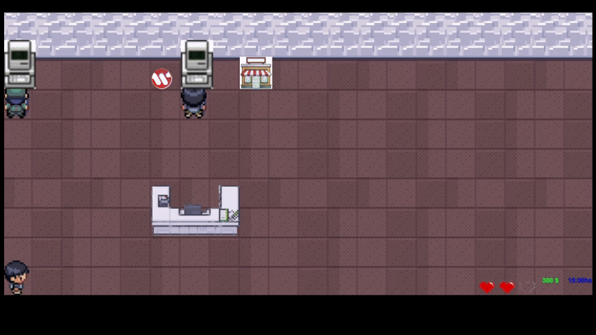

# Wollok Factory

## Introducción
*El juego trata sobre una empresa desarrolladora de Wollok, llamada Wollok Factory, cuyo objetivo es programar y vender productos Wollok a los clientes para así volverse millo... continuar el legado de nuestros queridos profesores.*  
En el camino, los jugadores deberán enfrentarse a desafíos como gestionar clientes exigentes, optimizar recursos y desarrollar innovaciones que mantengan la empresa a la vanguardia. ¿Podrás llevar este pequeño emprendimiento al siguiente nivel?

## Reglas de Juego
*Para poder empezar a jugar, hay que ejecutar el programa `main.wpgm` en el celebre IDE de Wollok.*  
El juego inicia con nuestro protagonista, quien deberá ser muy rápido para solucionar los problemas venideros. Al comenzar la partida, rápidamente se verá en la obligación de ir a programar, recoger el producto y entregarlo en el mostrador. ¡De lo contrario, el cliente agotará su paciencia y se irá! Ten cuidado: si perdemos nuestros tres corazones, será Game Over... Pero no seamos pesimistas: una vez que logremos estabilizar nuestra economía, ¡podremos ir al mercado a contratar empleados hasta construir un verdadero imperio digital!

## Controles
* Flechas: Movimiento.  
* E: Programar (computadora) e interacción (tienda).  
* J: Comprar empleados (solo en tienda).  
* R: Agarrar y entregar producto.  
* Enter: Iniciar partida.  
* F: Terminar juego.  

   

## Equipo de desarrollo
 * Ferreira Lucía
 * Miras Lautaro
 * Becerra José Luis
 * Cereghetti Felipe

## Acerca de:

 Docente / Curso / Institución:
  *  Lucas Spigariol - Ignacio Coluccio - Federico Sayago.
  *  K2002 Paradigmas de Programación.
  *  UTN FRBA.

  Versión de Wollok: 0.2.7  

 **Una vez terminado, no tenemos problemas en que el repositorio sea público.**  

  Fecha: Noviembre de 2024