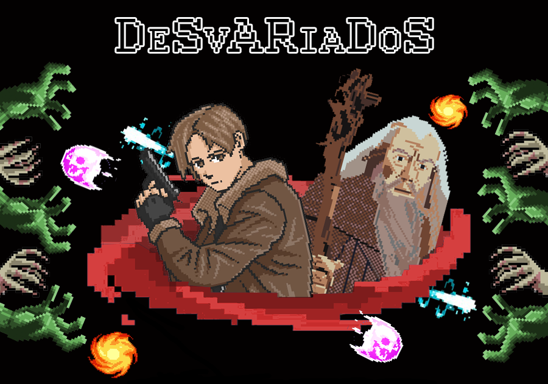
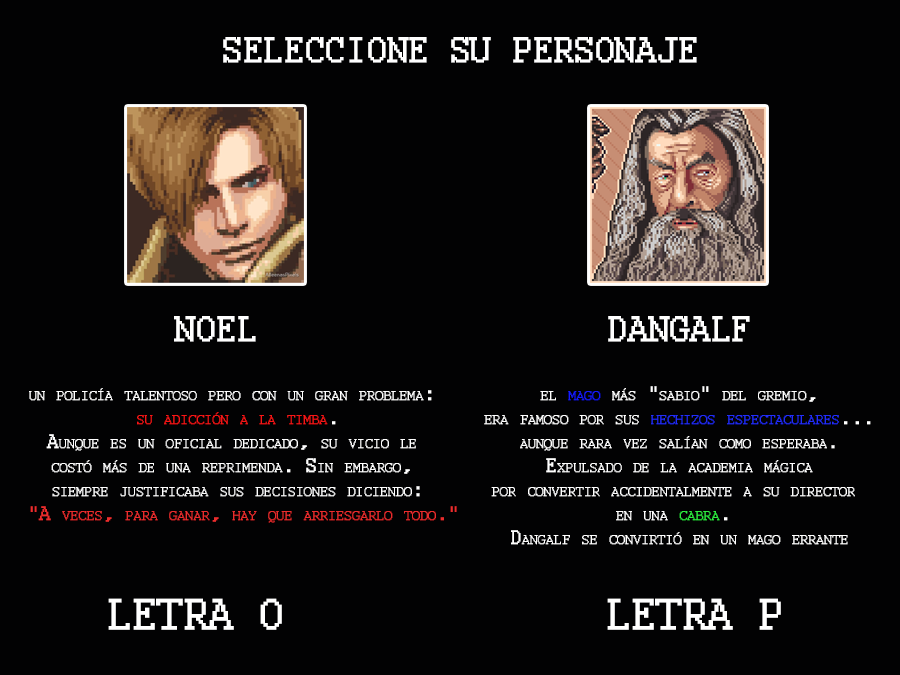
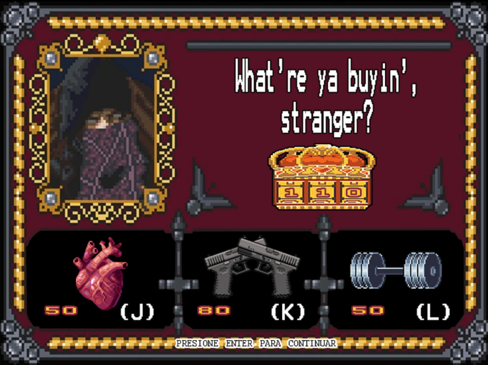
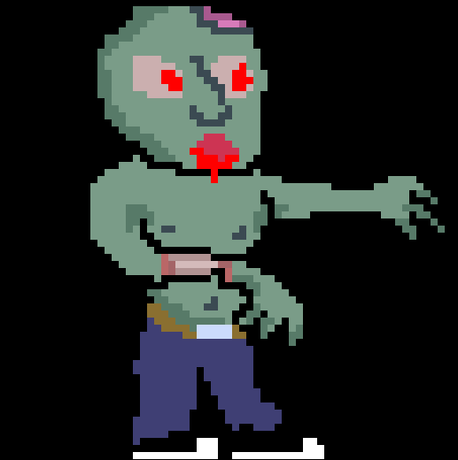
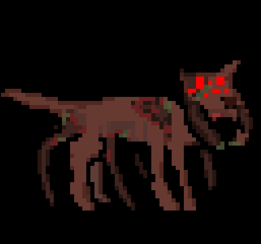
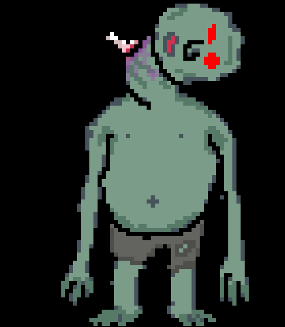

 
  

  <h1 align="center"> Video trailer </h1> 

  https://github.com/user-attachments/assets/09ee1441-1b60-49e4-a08e-b7c6344ea532

<h1 align="center"> Sobre el juego </h1> 

  <ul style="list-style: none">
    

      <h2 align="center"> 
        En Desvariados, el jugador podrá elegir entre controlar a Noel o Dangalf para derrotar zombies en 4 (o más :eyes:)
        niveles progresivamente más duraderos. Ambos manejan un rango de armas distintas, además de habilidades especiales, las 
        cuales pueden activar luego de asesinar a 6️ zombies. 
      </h2>
    

  </ul>

 

 
  

 

  <ul style="list-style: none">
    

      <h2 align="center"> 
        A través del juego, al finalizar cada nivel, el jugador tendrá la oportunidad de mejorar su arma, su energía y sus puntos
        de vida en la tienda para facilitar sus encuentros con varios enemigos. Para lo cual, necesitará del oro que fue consiguiendo
        durante su matanza.  
        💰 💰 💰 
      </h2>
    

  </ul>

 

 
  

 

  <ul style="list-style: none">
    

      <h2 align="center"> 
        Durante los niveles, el jugador tendrá que preocuparse por no quedarse sin balas o energía de movimiento cerca de alguno de 
        los 3 tipos distintos de zombies que puede encontrarse.  
        ⚡ 🔫 💚 
      </h2>
    

  </ul>

 

  <ul style="list-style: none">
    

      <h1 align="center"> Los Zombies!!🧟 </h1>
    

  </ul>

## Zombie común

 

### El zombie común es tan raro como su nombre lo indica, pero eso no le saca lo zombie. Persigue al jugador a una velocidad intermedia y puede soportar una cantidad "común" de daño.

 
 
 
 

## Perro zombie araña

 

### Ningún investigador quiso saber cómo se dio esta combinación macabra; es más fácil asumir que alguien no supo dibujar un simple perro y terminó viéndose así. Persigue al jugador a una velocidad muy rápida, pero es muy débil a cualquier tipo de ataque.

 

## Zombie tanque

 

### Si tuviese un cañón en vez de brazos, se volvería un tanque por completo. Persigue al jugador y carga sus ataques a una velocidad muy lenta, por lo que muchos lo subestiman, pero no vas a querer estar cerca cuando ataque o cuando muera. Puede aguantar grandes cantidades de daño y genera explosiones a sus alrededores, las cuales dañan gravemente a todo lo que se encuentre en rango, a todo, sin excepciones.

 
 
 
 
 
 

<h1 align="center"> Equipo de desarrollo </h1>

  <ul style="list-style: none">
    

      <h2 align="center">
        Acuña, Alan  
         
        Bogarín, Leandro  
         
        Fuentes, Joaquín  
         
        Mártire, Santiago  
         
      </h2>
    

  </ul>

 

 
 

  <ul style="list-style: none">
    

      <h3 align="center">
        Programación con Objetos 1  
         
        Wollok: v0.2.7  
        Queremos mantener el repositorio público
         
      </h3>
    

  </ul>

<!--
dasfasfga

 

## Otros

- Curso/Facultad
- Versión de wollok
- Una vez terminado, no tenemos problemas en que el repositorio sea público / queremos manternerlo privado 
-->

