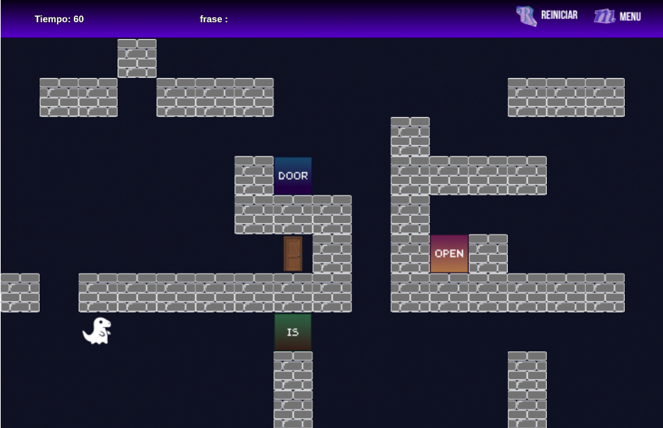
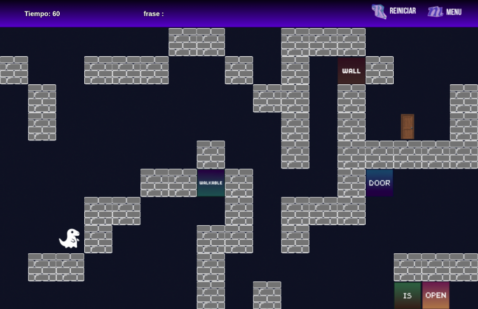
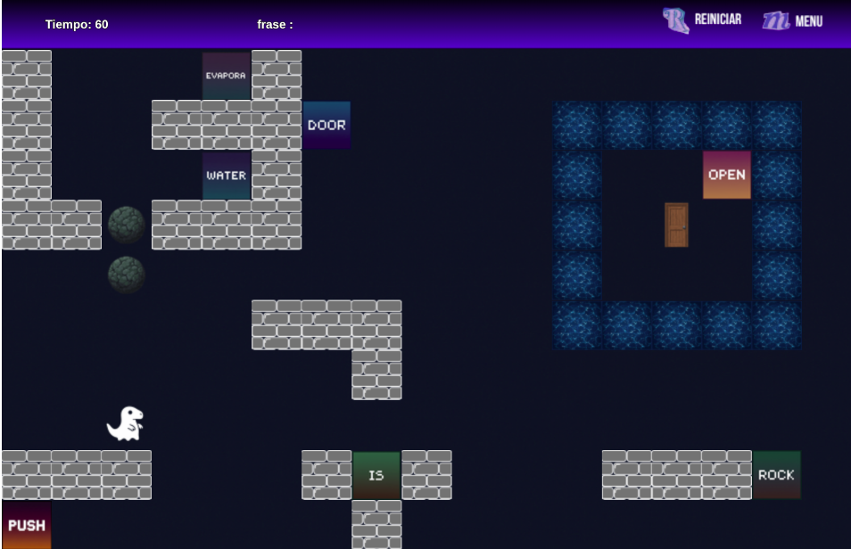

# Alana: Aventura entre Palabras

## Equipo de desarrollo

- Abrahan Alexis
- Baselo Antonella
- Escobar Alison
- Fernández Nicolás
- Sanchez Lisandro

## Niveles

  

  <em>nivel 1</em>

  

  <em>nivel 2</em>

  

  <em>nivel 3</em>

## Reglas de Juego

Tu misión es pisar palabras para armar una frase de tres palabras. Fácil, ¿no?

Peeero… ¡La frase solo vale si la armás en el orden correcto!, o sea de izquierda a derecha, bien prolijito.

Si lo lográs, ¡boom! La puerta se habilita y podés correr a pisarla para avanzar.

Pero ojo: el tiempo corre… y si se acaba antes de que atravieses la puerta, perdés y chau aventura.