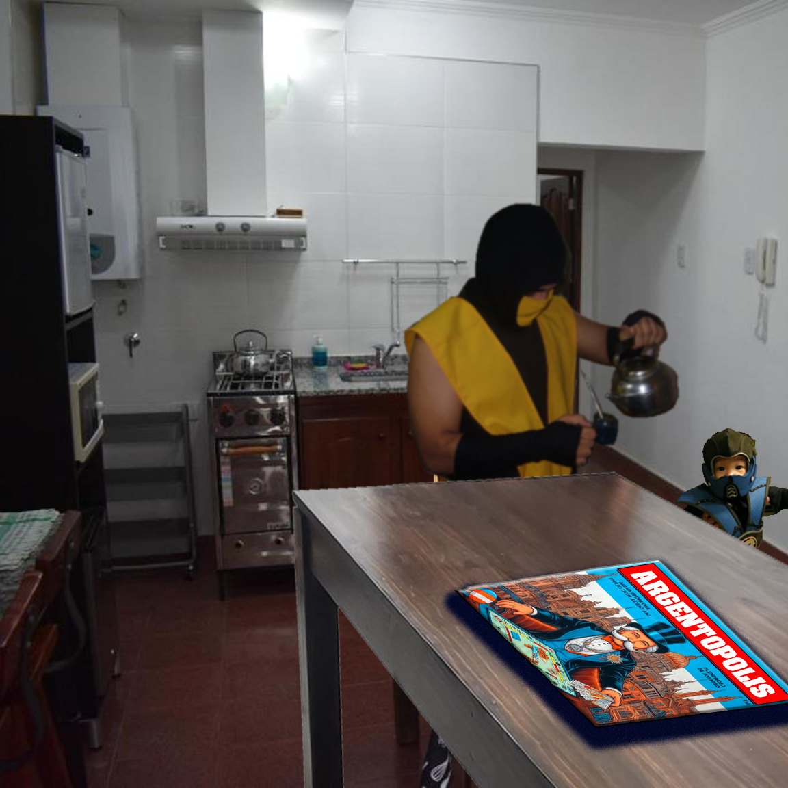
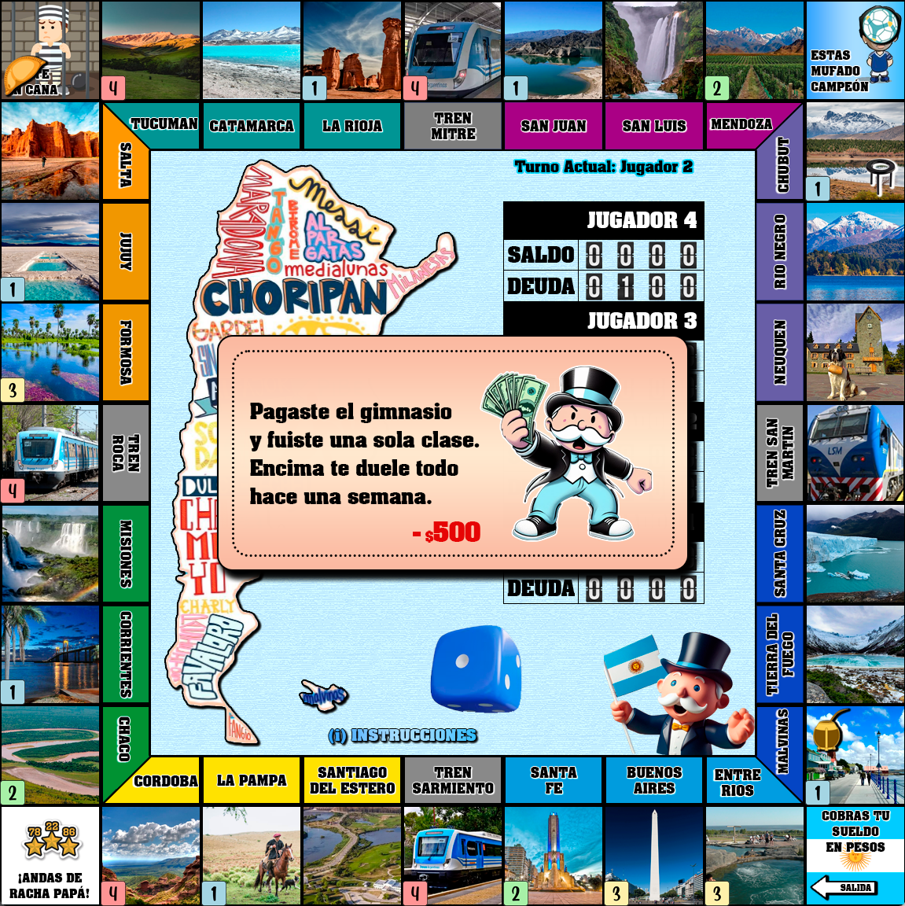
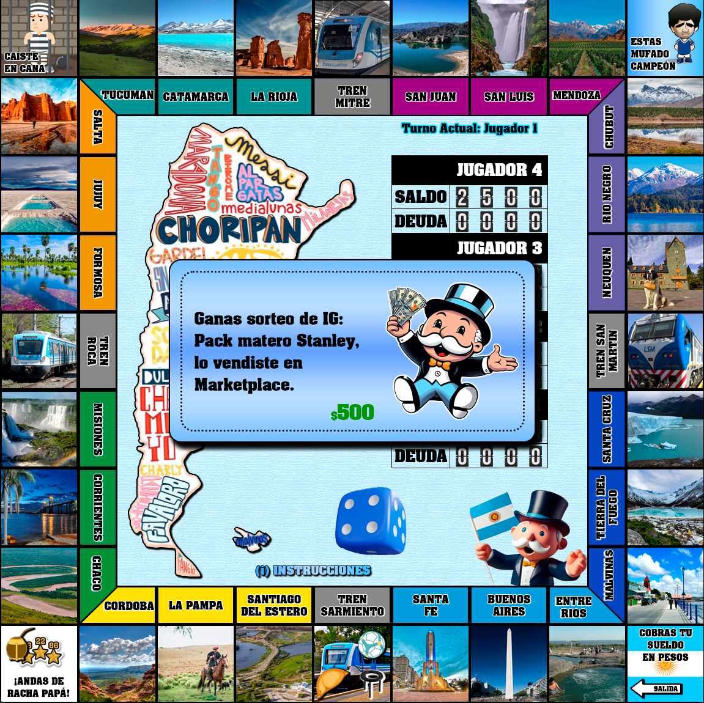
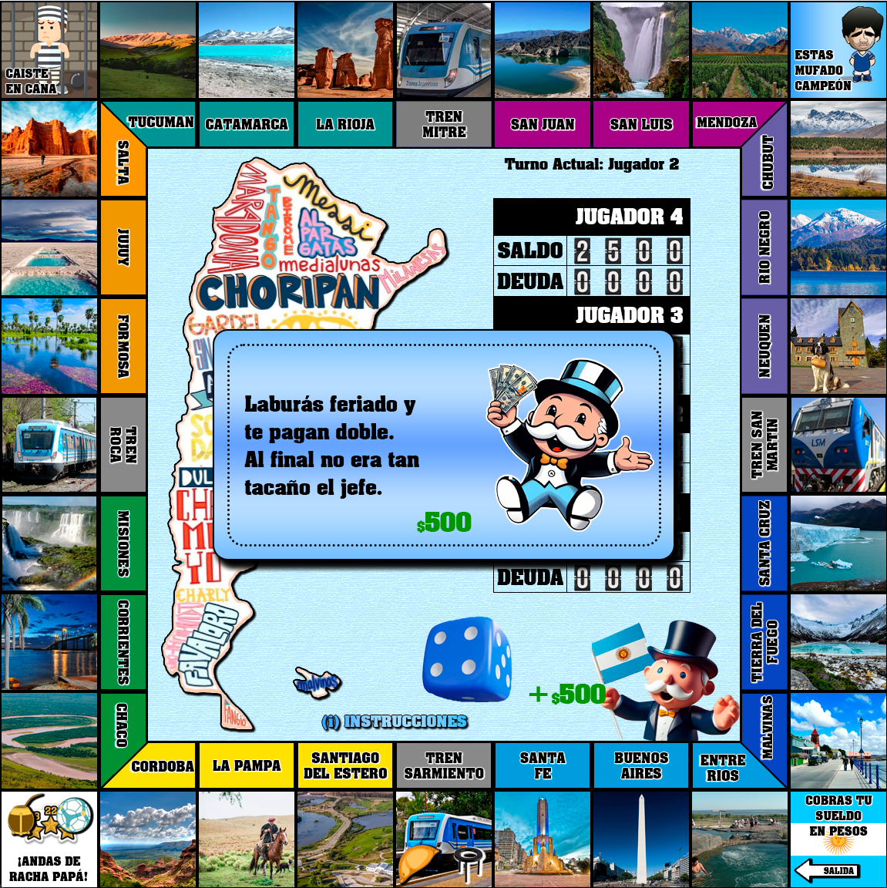
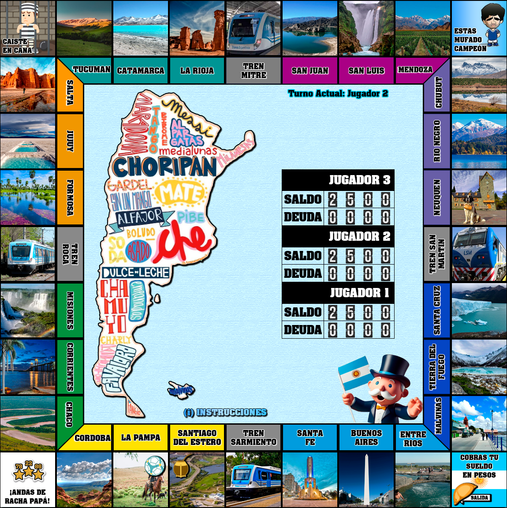
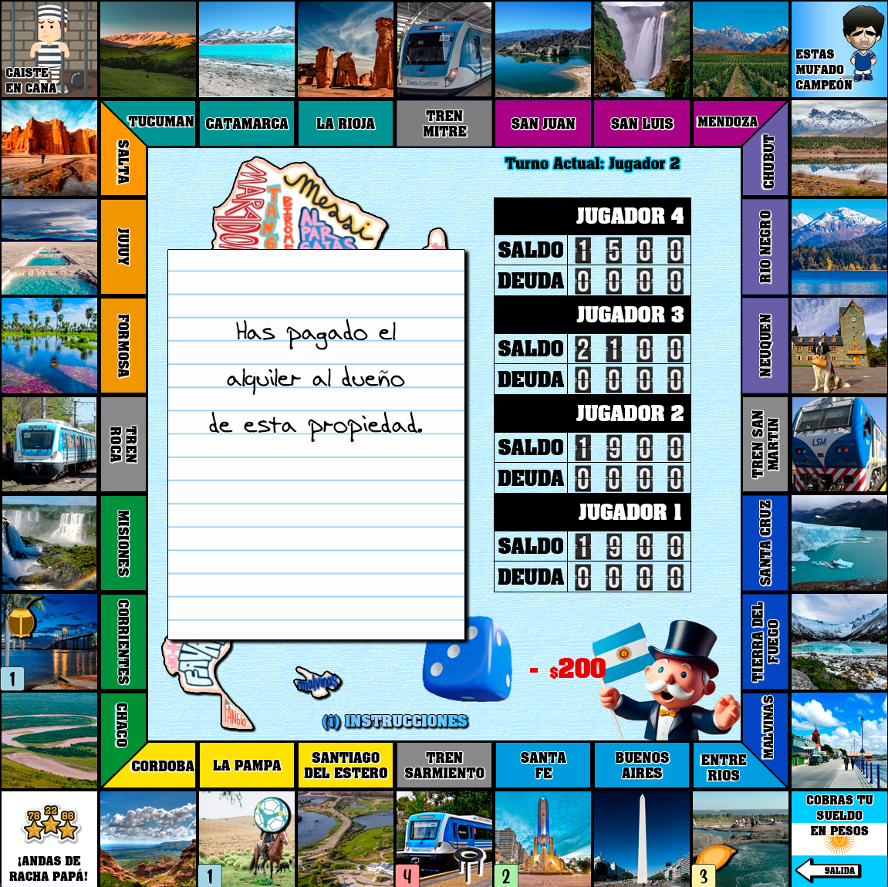
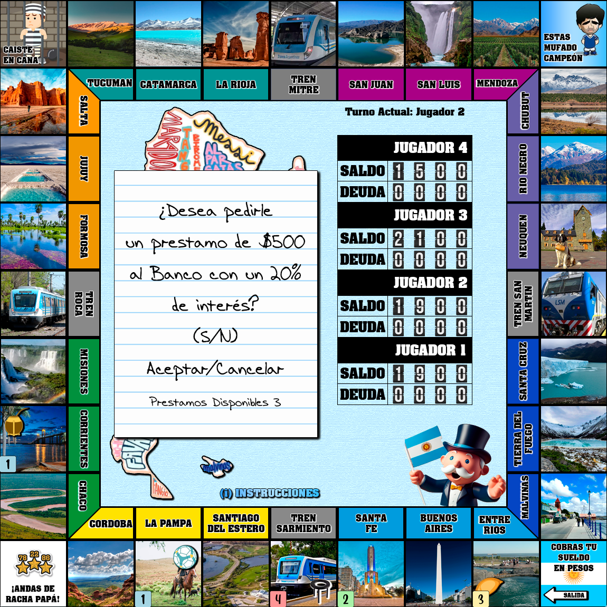
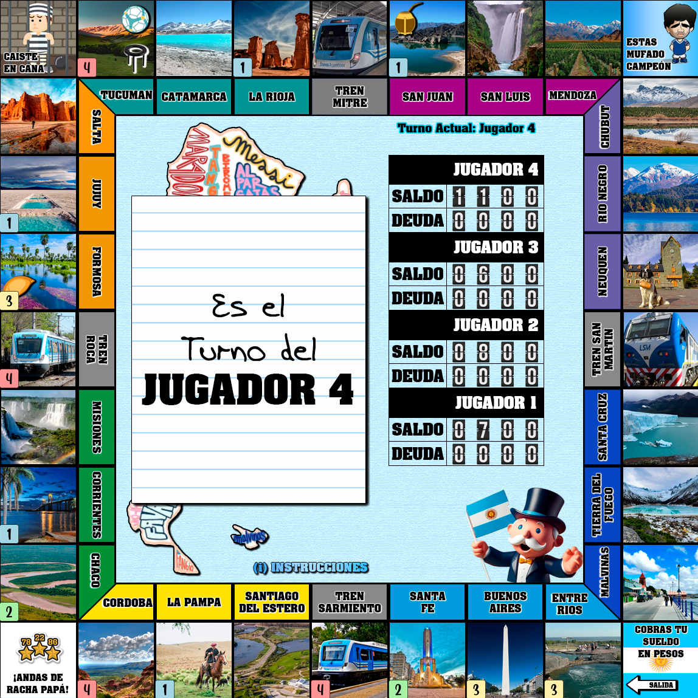
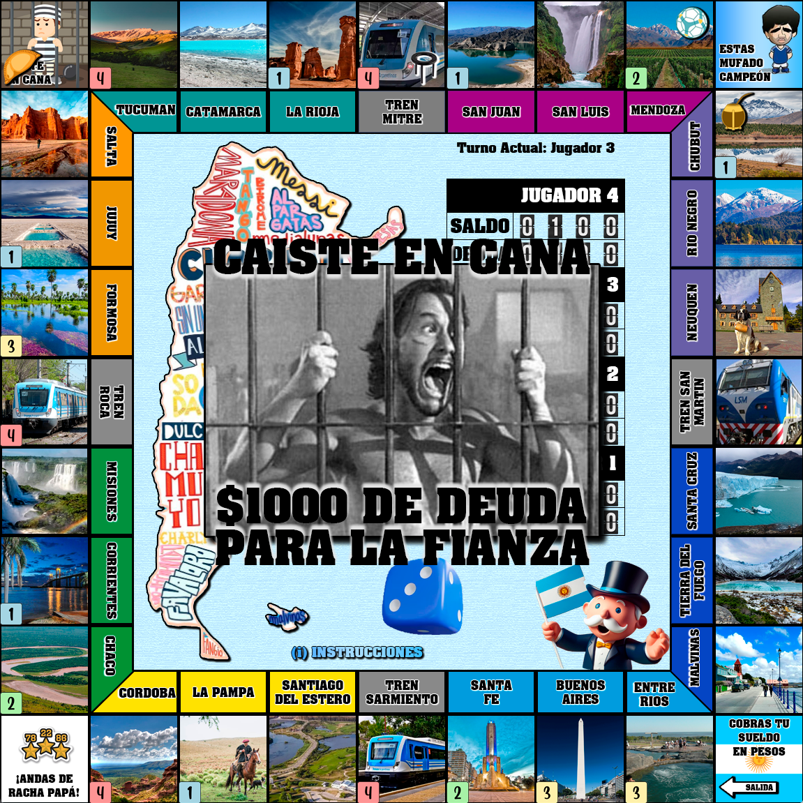

# Argentopolis

Este proyecto consiste en la creación de un juego estilo Monopoly con una temática argentina, implementado en el lenguaje de programación Wollok.

## Tabla de contenidos

- [Descripción](#descripción)
- [Reglas](#reglas-de-juego--instrucciones--configuraci%C3%B3n-de-teclas)
- [Capturas](#capturas)
- [Características](#características)
- [Contribución](#contribución)

## Descripción

El Argentopolis es una adaptación del clásico juego de mesa Monopoly, que incluye elementos y características
representativas del país. Los jugadores podrán disfrutar de una experiencia única mientras recorren las provincias
del país y adquieren las mismas para lograr convertirse en el ganador.

## Reglas de Juego / Instrucciones / Configuración de Teclas

Al abrir el juego se encontrarán con una pantalla principal donde podrán seleccionar entre 2, 3 o 4 jugadores con las Flechas **(Arriba)** o **(Abajo)**, y presionando **(Enter)** en su elección.
Con la tecla **(i)** podrán acceder a las Instrucciones e intercambiar entre las distintas páginas con las Flechas **(Derecha)** o **(Izquierda)**.
Para una información más detallada abra: [INSTRUCCIONES](INSTRUCCIONES.md)

## Capturas

## Características

- **Tablero**: El tablero del juego representa un mapa de Argentina, con casillas que representan diferentes provincias.
- **Provincias**: Cada casilla representa una propiedad que los jugadores pueden adquirir. Estas propiedades están basadas
en las Provincias de Argentina.
- **Dinero y Transacciones**: Los jugadores contarán con una cantidad inicial de dinero y podrán realizar transacciones para
comprar y vender propiedades entre ellos o con el banco.
- **Tarjetas de Sorpresa**: Se incluirán casillas de Racha o Mufa que añaden un elemento de aleatoriedad al juego. Estas tarjetas
pueden otorgar beneficios o imponer penalizaciones a los jugadores. Dichas tarjetas reflejarán situaciones o acontecimientos
relevantes de la cotidianidad Argentina.

## Contribución

Si deseas contribuir al desarrollo del juego Argentopolis, puedes seguir los siguientes pasos:

Realiza un fork del repositorio.
Crea una rama para tu nueva funcionalidad o corrección de errores.
Realiza los cambios necesarios en el código.
Realiza una solicitud de extracción (pull request) describiendo los cambios realizados.
Tu solicitud de extracción será revisada y, si es aceptada, se fusionará con la rama principal del proyecto.

### Proyecto final de la materia **Programación orientada a objetos I**, de la **Universidad Nacional de Hurlingham** (UNAHUR)

¡Esperamos que disfrutes del Argentopolis!
