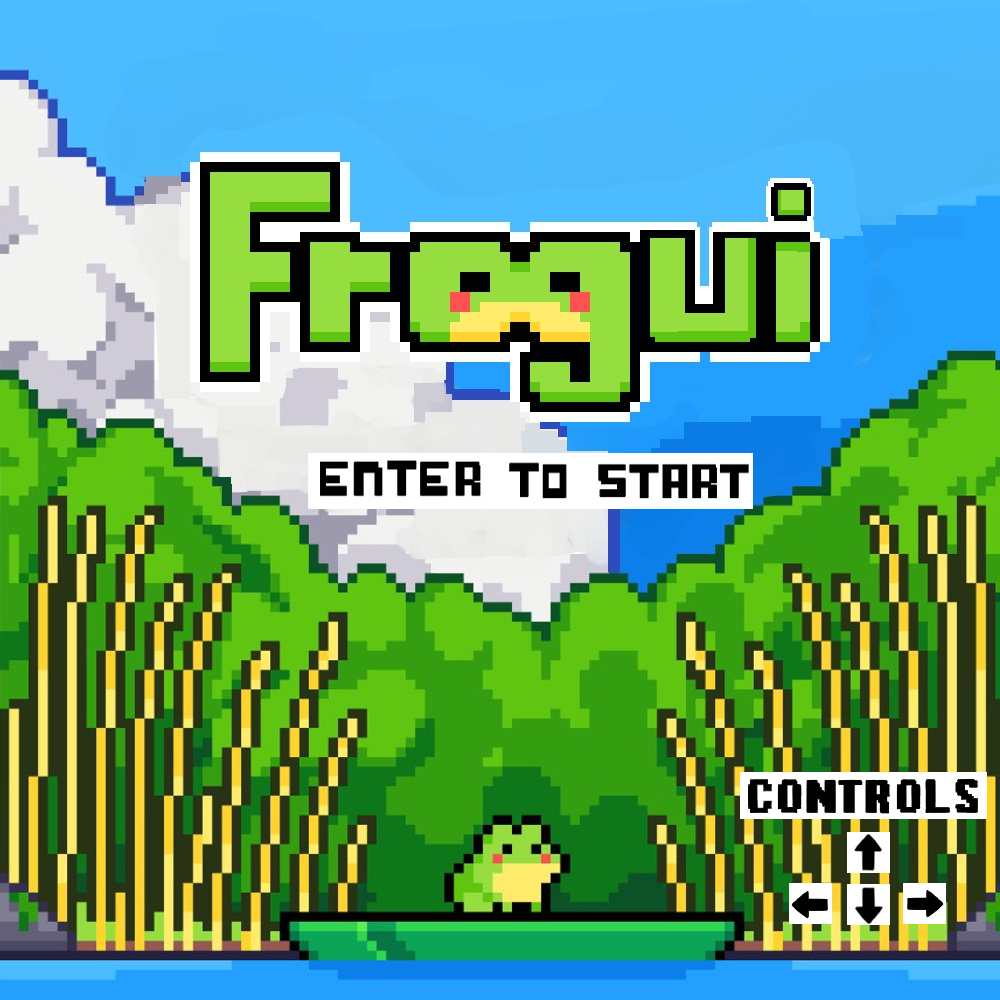
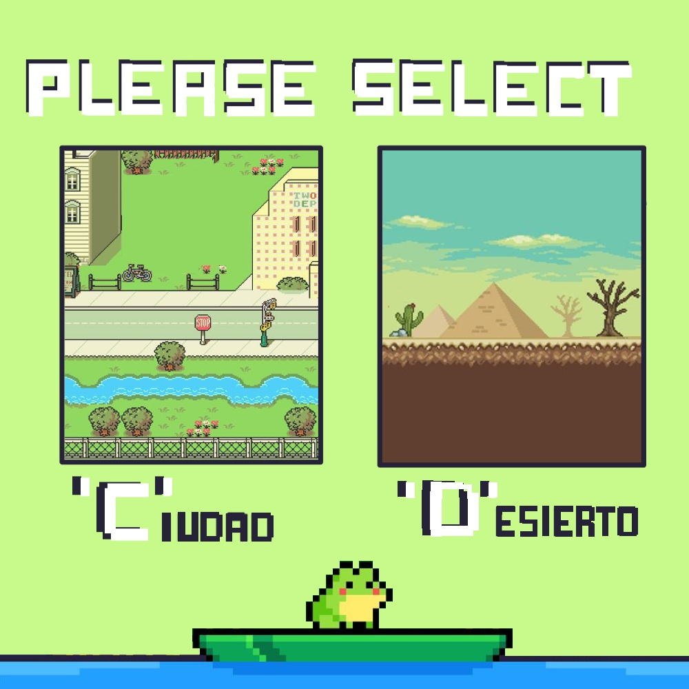

# Frogui game

## Capturas

## Reglas de Juego / Instrucciones
"Frogui" es una rana que debe cruzar varios niveles llenos de obstáculos para poder ganar. Hay dos escenarios diferentes "Ciudad" y "Desierto", según cual sea elegido los obstaculos varian. Cada nivel cuenta con dos o tres metas (objetivos) las cuales la rana debe llegar a cada una para desbloquear el siguiente nivel. Ayuda a frogui a alcanzar cada objetivo mientras evitas los peligros en el camino y, como extra, recolectas puntos!

## Equipo de desarrollo

- Thiago Mutuverria
- Alina Marquez
- Facundo Gimenez
  
## Otros

- POO 1, UNAHUR.
- Versión de wollok: 3.0.0
- Una vez terminado, no tenemos problemas en que el repositorio sea público.

