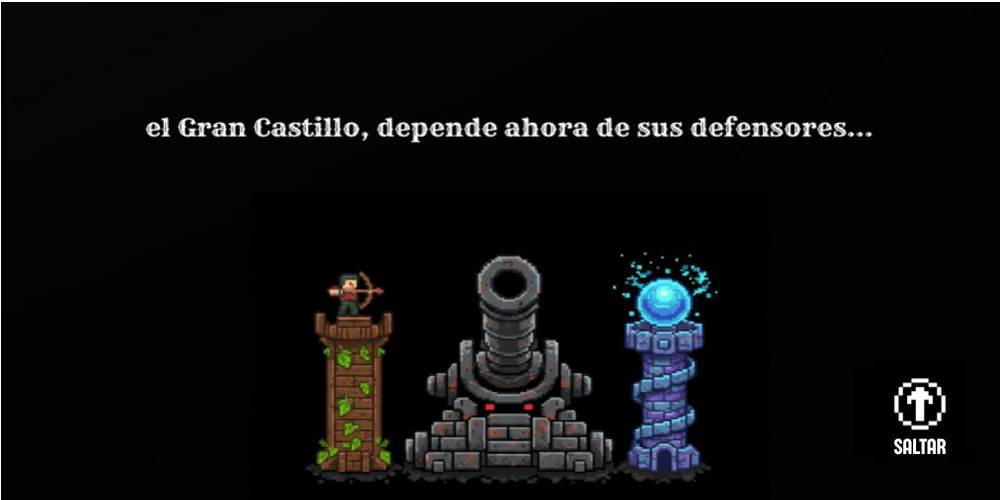
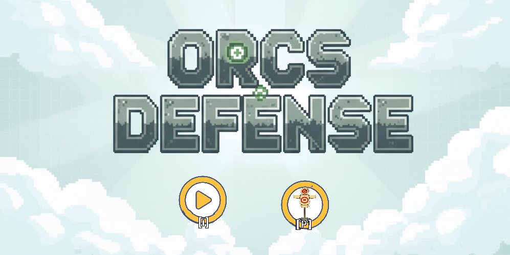
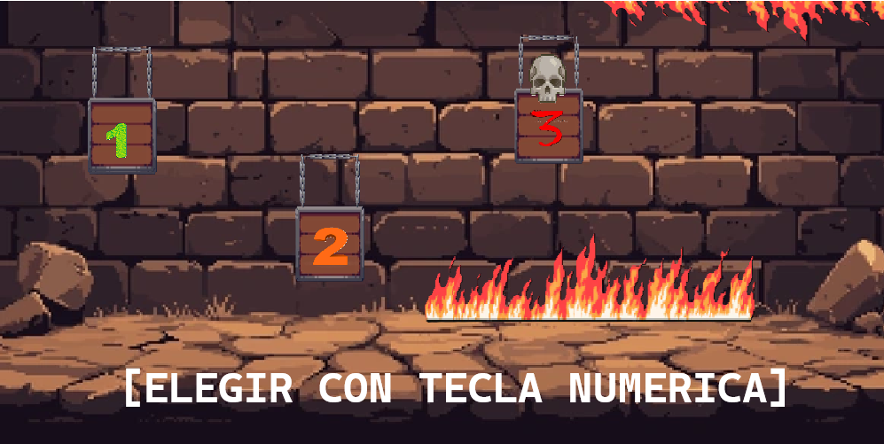
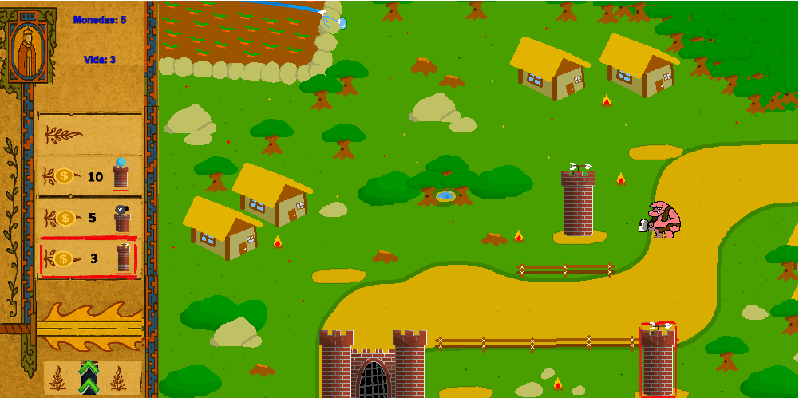

# Orcs Defense   

## Equipo de desarrollo

- **Elias Llorens**, diseño grafico inicial y desarrollo, organizacion General: [@Llorenss85](https://github.com/Llorenss85)
- **Fabricio Pereyra**, desarrollo: [@fabriciopereyra2004a-rgb](https://github.com/fabriciopereyra2004a-rgb)
- **Juan Belforte**: [@NamuKimeraVT](https://github.com/)
- **Martin Galletti**, organizacion y desarrollo: [@TinchoProjects](https://github.com/TinchoProjects)
- **Nahuel Menchaca**, diseño y desarrollo: [@nawuelito](https://github.com/nawuelito)
- **Tomas Cardenas**, musica, diseño grafico final y desarrollo: [@TomasCardenas932](https://github.com/TomasCardenas932)

## Capturas

## Reglas de Juego / Instrucciones

## Controles
### General
- M: Abre el menu de los controles junto con las reglas
### Eleccion de torres
- W:Sube en la eleccion de torres posibles.
- S:Baja en la eleccion de torres posibles.

## Eleccion de lugares de posicionamiento de torres

- Flecha Arriba: Mueve el cursor al siguiente lugar posible para poner una torre.
- Flecha Abajo: Mueve el cursor al anterior lugar posible para poner una torre.
- Barra espaciadora: Ejecuta la acción del cursor, sea poner la torre o borrarla, en la posicion actual.

# Reglas

- Los orcos no deben llegar al castillo, si llegan perdes vida hasta eventualmente perder
- No se pueden poner varias torres en una misma ubicacion
- Los orcos tiene lacayos, los verdes, que son menos resistentes y su rey, el rojo, el cual es mas resistente hice mucho mas daño

## Otros

- UNAHUR, Programacion orientada a objetos 1, comision 4, segundo cuatrimestre 2025
- Versión de wollok: 1.0.2
- No tenemos problemas en que el repositorio sea público
