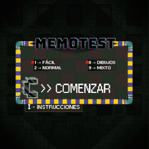
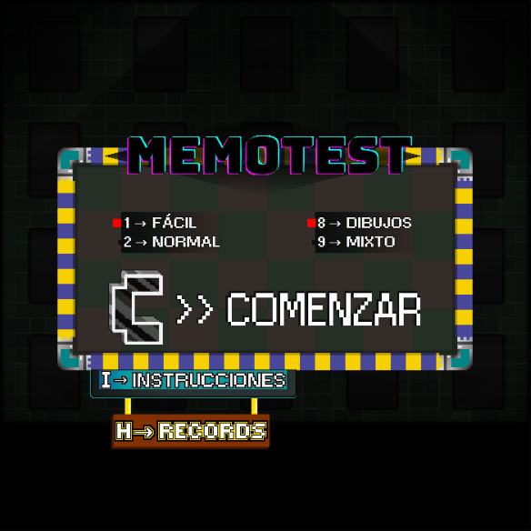
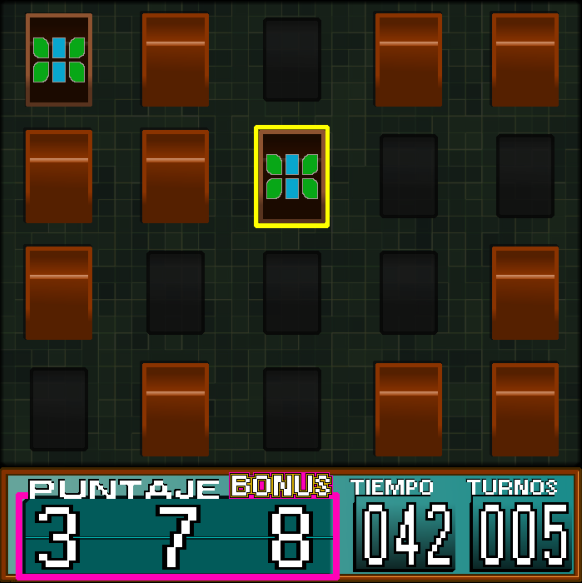
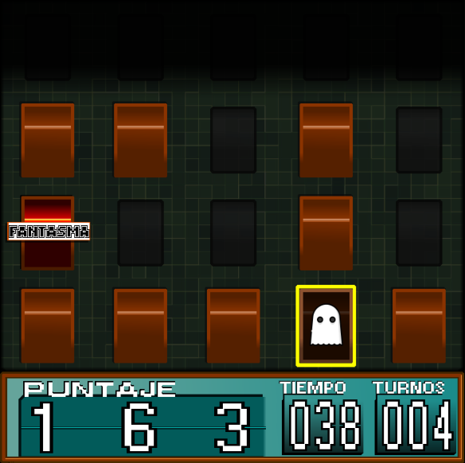

# MemoTest

## Equipo de desarrollo

- Anngie Murillo
- Brian Mercer Alsina
- Lautaro Altamirano
- Matias Denis Fallico

## Reglas de Juego / Instrucciones

El objetivo de este juego es encontrar todos los pares de cartas iguales en el menor número de turnos posible para conseguir la puntuación más alta.

**Objetivo del juego**

Encontrar y emparejar todas las cartas iguales en el tablero.

**Setup del juego**
1. Preparación del tablero

    En el menú inicial, se elige entre Modo Fácil o Normal (esto determina la cantidad de pares) y si serán cartas con solo Dibujos, o si cada par será carta Dibujo y carta Texto

*   Modo Fácil  (7 pares)
*   Modo Normal (10 pares)

*   Modo Dibujos
*   Modo Mixto

Dentro de este menú, se puede también acceder a la lista de Récords (Highscores) y a las instrucciones.

2. Inicio del juego

*   El juego comienza con todas las cartas boca abajo.
*   El jugador comienza su primer turno.

**Cómo jugar**

1.	*Voltear la primera carta:* El jugador selecciona una carta del tablero y la voltea para revelar su dibujo.

2.	*Voltear la segunda carta:* El jugador selecciona una segunda carta (que aún esté boca abajo) y la voltea para revelar su dibujo.

3.	*Comprobar la coincidencia:*

*   Si las cartas coinciden (son iguales): ¡Éxito! El jugador gana puntos. Las cartas se retiran del tablero para indicar que ese par ha sido completado. El turno termina.
*   Si las cartas NO coinciden (son diferentes): Fracaso. Se voltean ambas cartas para que vuelvan a estar boca abajo. El turno termina.

4.	*Fin del turno:* El jugador continúa repitiendo los pasos 1, 2 y 3 hasta que todas las cartas hayan sido emparejadas.

**Puntuación**

•	*Puntos por par encontrado:* Cada vez que el jugador encuentra un par, se suman puntos a su marcador.

•	*Puntos extra por cadena de correctos:* Bonus de puntos extra si se encadenan volteos de cartas iguales.

•	*Resta de puntos por intento fallido:* Cada vez que el jugador tiene un intento fallido, se restan puntos a su marcador.

•	*Puntuación Final:* La puntuación final se registra en la fila de abajo.

**Fin del Juego**

El juego termina cuando todos los pares de cartas han sido encontrados (es decir, todas las cartas han sido retiradas).
Entonces puede ingresar sus iniciales y registrar su puntuación en los records.

También, en cualquier momento, puede reiniciarse el juego al presionar la tecla R, para volver al Menú Inicial.

## Otros

- UNAHUR - Programación con Objetos 1 - 2ºC 2025 - HC
- Versión de wollok: 4.2.3
- Una vez terminado, no tenemos problemas en que el repositorio sea público

## Capturas

- **Primera Demo**

- **Imágenes Versión Final**

