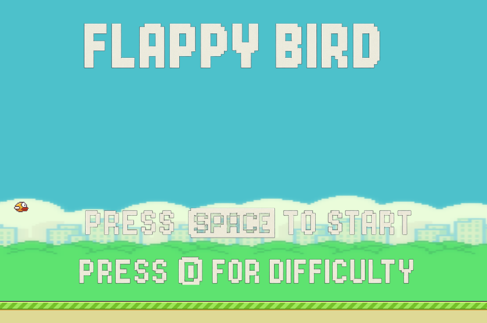
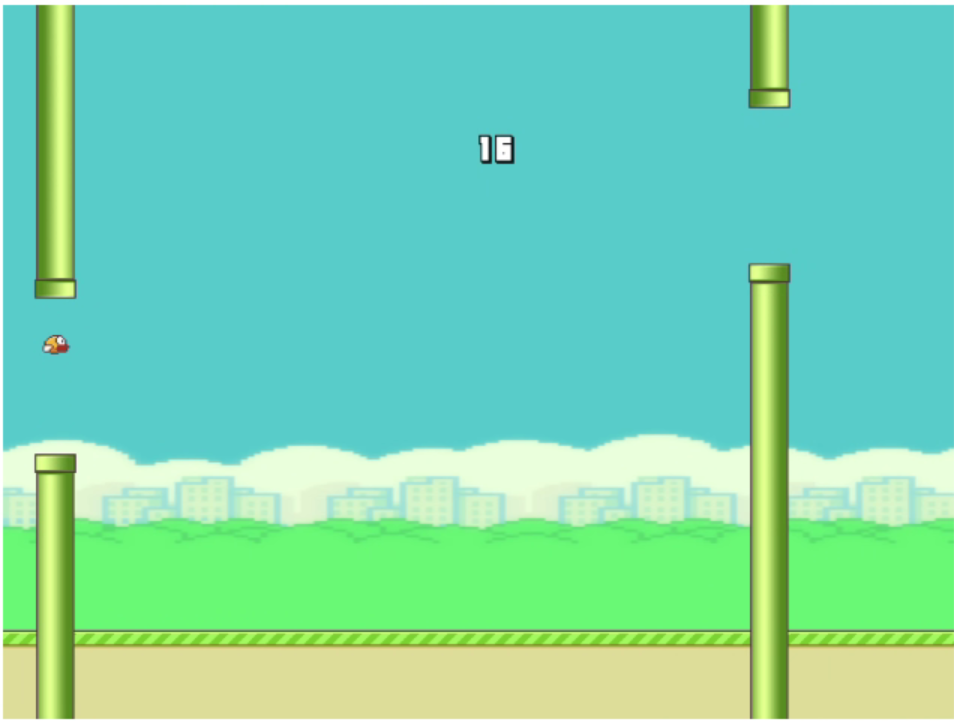
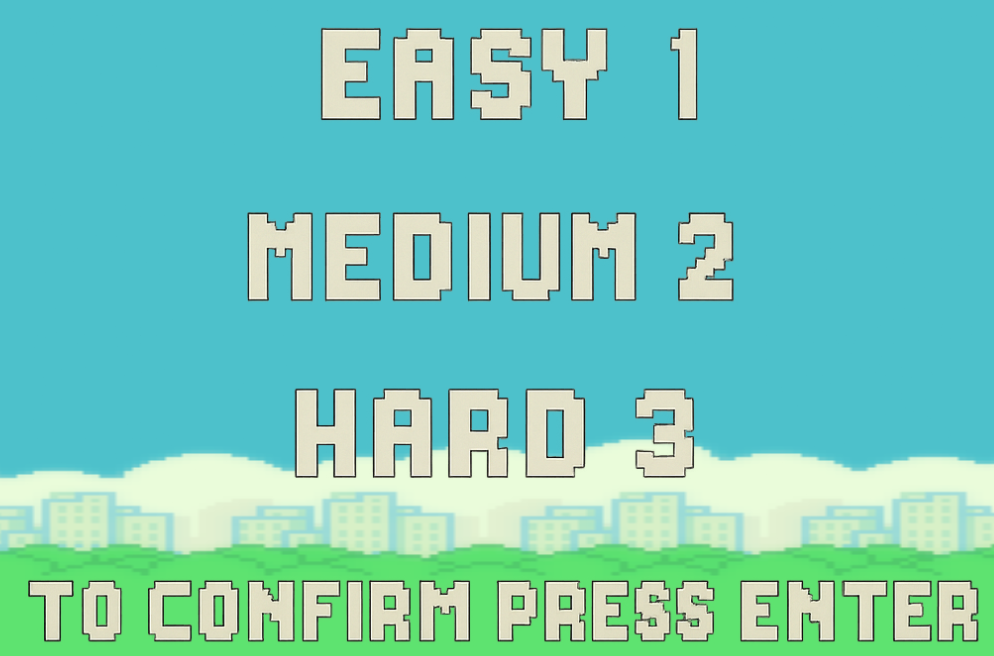

# Flappy Bird

## Equipo de desarrollo

- Gerace Manriquez Cesar Bosco
- Mateo Sanchez Sa
- Nahuel Nicolas juarez

## Capturas

## Reglas de Juego / Instrucciones

- No te choques los tubos
- No te choques contra el piso
- Pasa entre los tubos para sumar puntos
- Divertite

## Otros

- UNAHUR 
- Versión de wollok: 0.3.1
- Una vez terminado, no tenemos problemas en que el repositorio sea público
