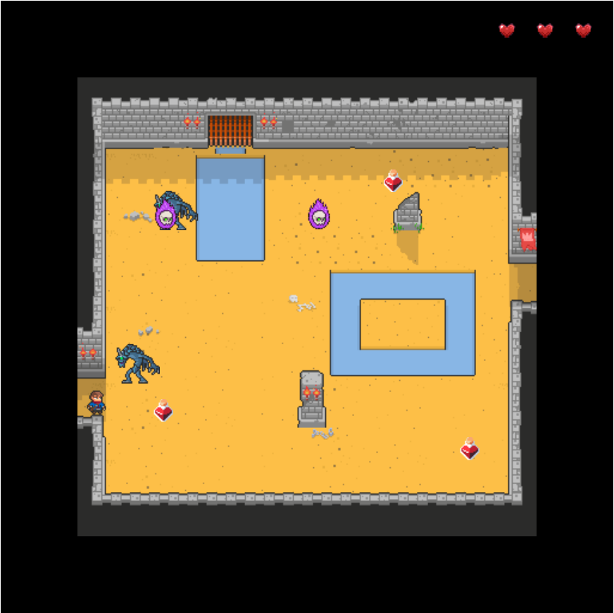
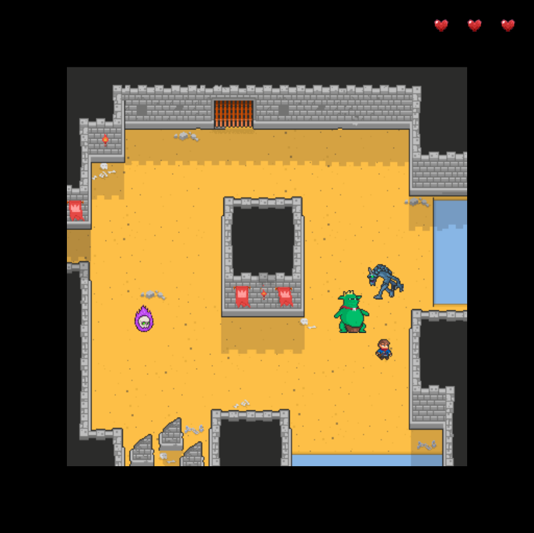

# Las Aventuras de Coco

## Equipo de desarrollo

- Facundo Torres
- Pablo Cortese
- Milagros Carucci
- Diego Brauer

## Capturas

## Reglas de Juego / Instrucciones

Un juego que transcurre en un calabozo el cual el personaje debe intentar escapar de el, para esto debera pelear por su vida.
El personaje tiene que pelear contra monstruos los cules le iran haciendo daño. Este cuenta con pociones de vida para sobrevivir.
Para poder ganar, debe poder matar a los monstruos del primer nivel para poder pasar a la puerta que lo llevara al siguiente nivel, Donde aparece el jefe final.
Una vez derrotado el jefe y sus monstruos, coco podra liberarse del calabozo.

## Controles

- "e" para atacar a los enemigos, los enemigos tienen que estar cerca del personaje para recibir el daño.

- "q" se usa para preguntar la vida del jugador en el momento.

- "flechas arriba, abajo y a los costados" se usa para mover al personaje

## Otros

- UnaHur
- Versión de wollok
- Una vez terminado, no tenemos problemas en que el repositorio sea público
