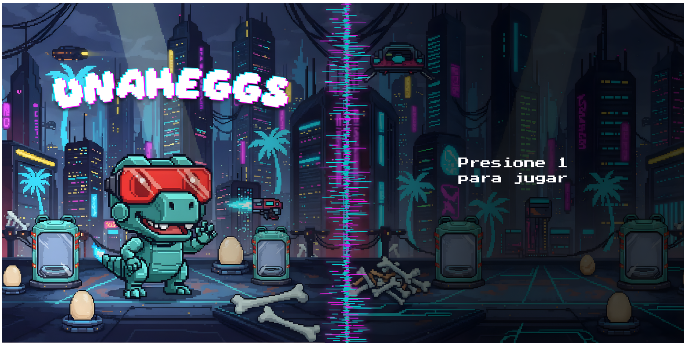
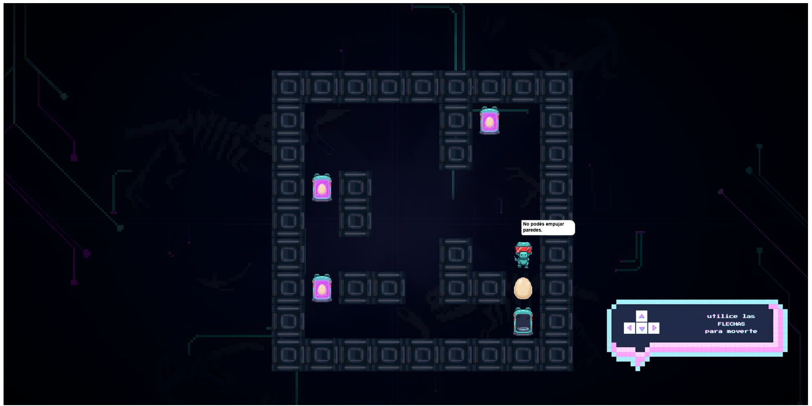
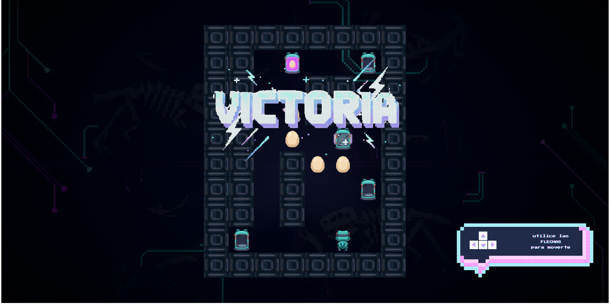
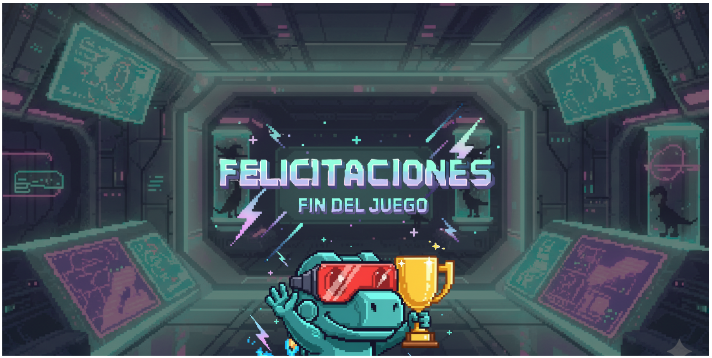

# UNAHBox

## Equipo de desarrollo

- Ignacio Martínez
- Kevin Alemanno
- Franco Zárate
- Santiago Prado
- Joaquín Acosta
- Ariel Delgadillo

## Sinópsis

En un futuro lejano, la humanidad llevó a los dinosaurios de vuelta a la vida. La biotecnología logró fusionar ADN reptiliano con inteligencia artificial, creando a los DinoMechs: criaturas mitad metal, mitad memoria de un mundo extinto.

Pero el planeta se volvió inestable. La contaminación y la guerra por recursos destruyeron los hábitats de estas nuevas especies. Los humanos desaparecieron… y solo quedaron las máquinas.

Nuestro héroe, el Dino, fue el último de los DinoMechs programados con un propósito ancestral: preservar la vida. En los laboratorios derrumbados de la Universidad de Hurlingham, descubre huevos de dinosaurio y cápsulas incubadoras capaces de devolver la esperanza. Los huevos contienen material genético original rescatado del pasado mientras que las cápsulas son incubadoras capaces de recrear un ecosistema viable.

Nuestro héroe no está creando más robots: está devolviendo al mundo una forma de vida real, orgánica. Cada huevo que coloca es una chispa de futuro, una promesa de equilibrio en un mundo que olvidó lo que era estar vivo.

Cada paso es un intento de reconstruir la historia. 🙌

## Capturas

## Reglas de Juego / Instrucciones

    Tipo de juego: Puzzle - Sokoban

    Ubicá los huevos de dinosaurio en la meta. 🥚

    Conseguí la llave para avanzar. 🗝️

    Ayuda: tocá 'r' para reiniciar el nivel. 😙    

## Otros

- Curso/Facultad: Programación con objetos 1 | UNAHUR
- Versión de wollok:  0.4.1
- Una vez terminado, no tenemos problemas en que el repositorio sea público. ✅
