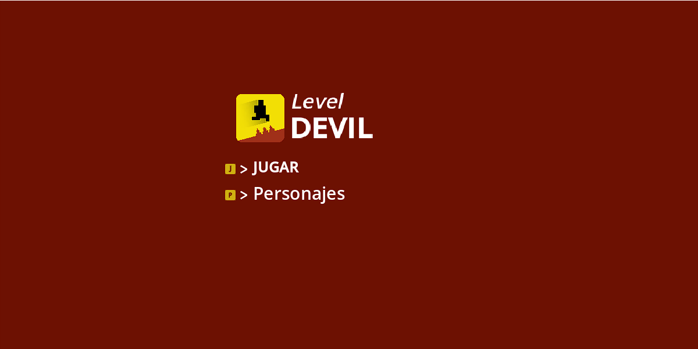
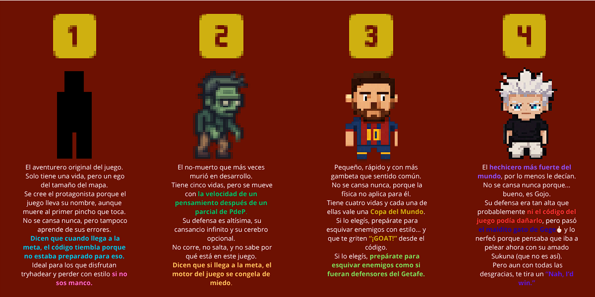
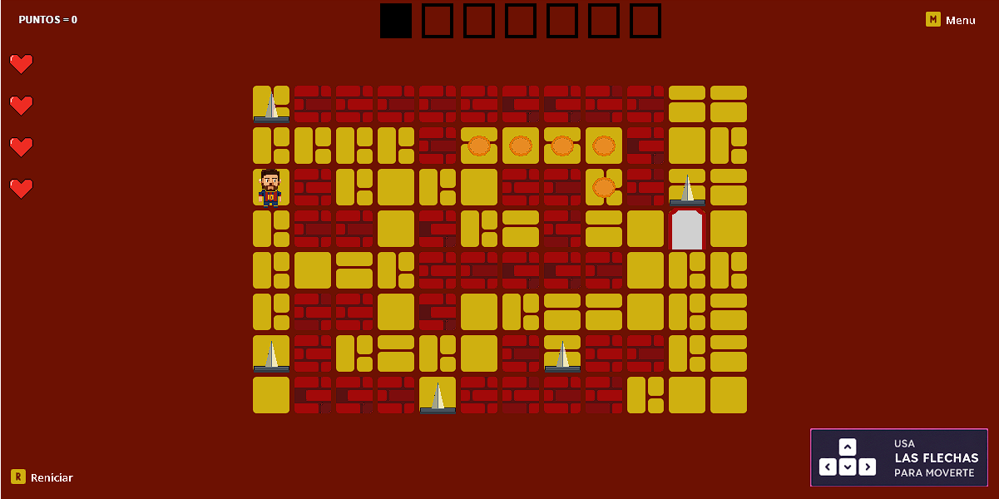
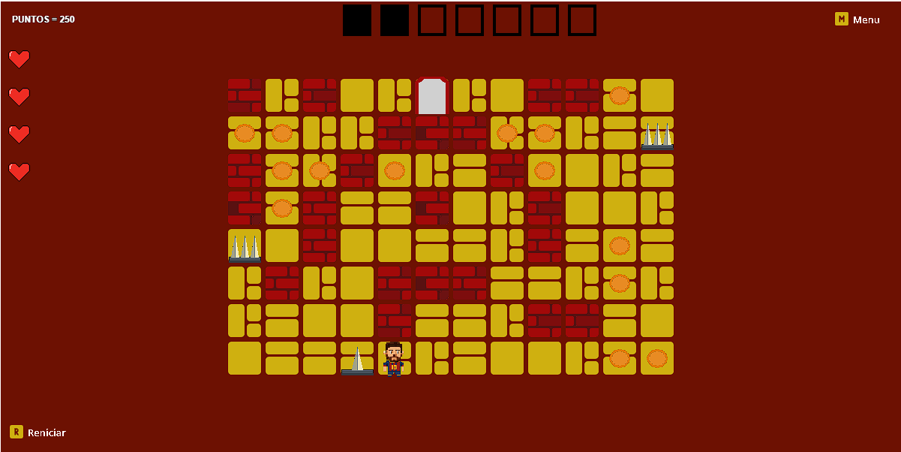
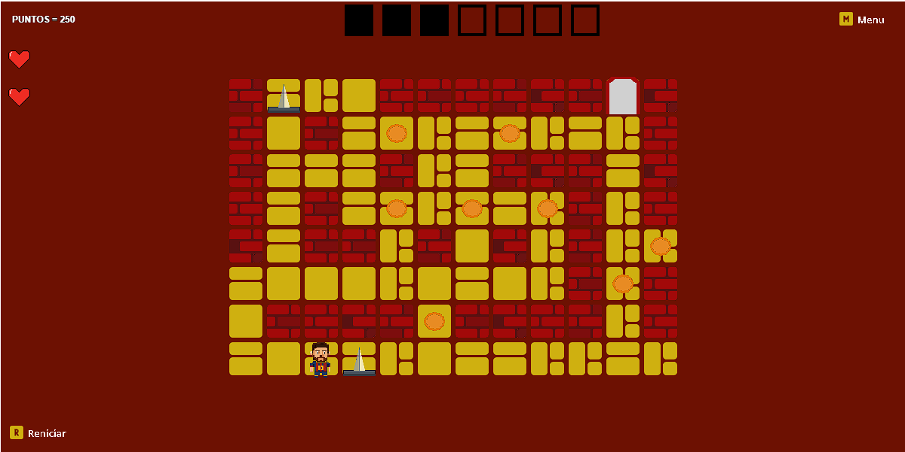
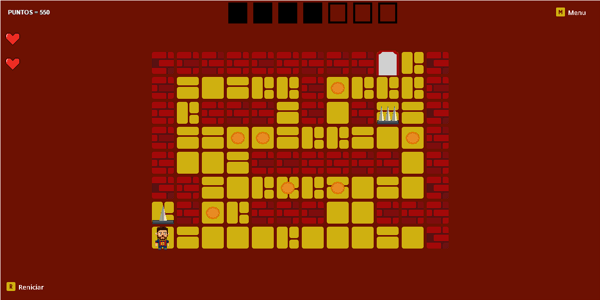

# Level Devil 👿

> Es un juego troll donde pasarás 7 niveles evitando trampas, recolectando monedas y consta de 4 personajes con sus diferentes características que te tratarán para pasar los niveles. Se utilizaron los conceptos de la materia *Paradigmas de Programación* para su desarrollo.

<div align="center">
    
</div>

**Desarrollado por:** Grupo **GroupNotFound** de la materia *Paradigmas de Programación (**Profesor:** Alfredo Sanzo)* K1054 martes a la noche, 2025 Anual - UTN Facultad Regional de Buenos Aires.

---

## 👥 Equipo de Desarrollo

| Desarrollador | GitHub |
|---|---|
| Dario Asurey | [@Dasurey](https://github.com/Dasurey) |
| Mayra Garcia | [@mayraegarcia](https://github.com/mayraegarcia) |
| Agustin Fernandez | [@Agustinf019](https://github.com/Agustinf019) |

---

## 🎮 Acerca del Juego

**Level Devil** es un desafiante juego de plataformas donde deberás:

- ✅ Navegar a través de 7 niveles de dificultad creciente
- ✅ Evitar trampas y enemigos que te "trollearán" en el intento
- ✅ Recolectar monedas para maximizar tu puntuación
- ✅ Elegir entre 4 personajes únicos con diferentes características
- ✅ Demostrar dominio de conceptos como polimorfismo, herencia, encapsulamiento, abstracción y recursividad

### Sistema de Defensa: Potencial Defensivo

Cada personaje tiene un **potencial defensivo** que determina cuánto daño puede resistir:

```
Potencial Defensivo = (Vidas × 10) + Bonificación del Personaje
```

**Cómo funciona:**
- Si un enemigo tiene **ataque > tu defensa** → ¡Recibes daño y pierdes una vida!
- Si un enemigo tiene **ataque ≤ tu defensa** → ¡Te proteges y no recibes daño!
- **Cuanto menos vidas tengas, MENOR será tu defensa** → Te vuelves más vulnerable

**Ejemplo con satoruGojo** (Defensa base +150):
- Con 3 vidas: `10 × 3 + 150 = 180` (muy fuerte)
- Con 2 vidas: `10 × 2 + 150 = 170` (vulnerable)
- Con 1 vida: `10 × 1 + 150 = 160` (peligro extremo)

**Estrategia:** Evita recibir daño para mantener tu defensa alta. ¡Cada golpe te debilita más!

## 📸 Capturas del Juego

### Pantalla de Inicio
<div align="center">
    
</div>

### 👥 Menú de Selección de Personajes
<div align="center">
    
</div>

### Gameplay - Niveles
<div align="center">
    <div style="display: grid; grid-template-columns: repeat(2, 1fr); gap: 15px; width: fit-content;">
        
        
        
        
        
        
        
    </div>
</div>

## 🕹️ Cómo Jugar

### Paso 1: Selecciona tu Personaje
- Presiona **P** seguido de un número **1-4** para elegir tu personaje
- Cada personaje tiene atributos únicos

### Paso 2: Comienza el Juego
- Presiona **J** para iniciar

### Paso 3: Navega los Niveles
- Usa las **flechas del teclado** (↑ ↓ ← →) para moverte
- Recolecta todas las monedas que puedas
- Evita los pinchos, enemigos y trampas
- Alcanza la meta para completar el nivel

### Paso 4: Domina los 7 Niveles
- Completa todos los niveles para ganar el juego
- Tu objetivo final: **Llegar al Nivel 7 con la mayor cantidad de puntos**
- **Necesitas conseguir al menos 3500 puntos para ganar** 🏆
- **Aviso:** Sí, puedes tener puntaje negativo. Felicidades! 🎉

> ⚠️ **Advertencia:** Algunos niveles tienen un teclado impredecible. ¡Mantente alerta!

## ⌨️ Controles

<div align="center">

| Tecla | Acción |
|:---:|:---|
| **P** + **1-4** | Seleccionar personaje |
| **J** | Jugar / Iniciar nivel |
| **R** | Reiniciar nivel actual |
| **M** | Ir al menú principal |
| **↑ ↓ ← →** | Movimiento del personaje |


</div>

## 📚 Fundamentos Técnicos

Este proyecto es una aplicación práctica de conceptos clave de la materia *Paradigmas de Programación*:

- **Polimorfismo** 🔄 - Objetos responden de forma distinta a los mismos mensajes
- **Herencia** 🧬 - Jerarquía de clases reutilizando código
- **Encapsulamiento** 🔒 - Datos expuestos mediante métodos
- **Recursividad** 🔁 - Funciones que se llaman a sí mismas para resolver problemas complejos
- **Abstracción** 🎯 - Simplificación ocultando detalles innecesarios y enfocándose en lo esencial 

Para una explicación detallada de la arquitectura, el diseño de clases y los principios aplicados, consulta:

👉 **[Teoría, Diseño Técnico y Fundamentos de la Solución](./TeoriaYDisenio.md)**