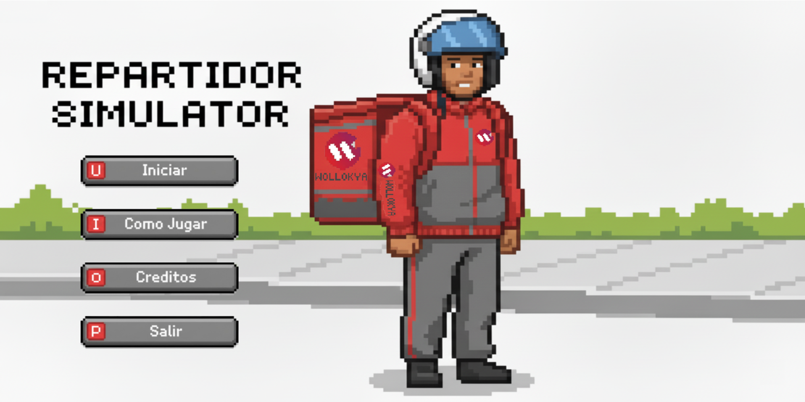
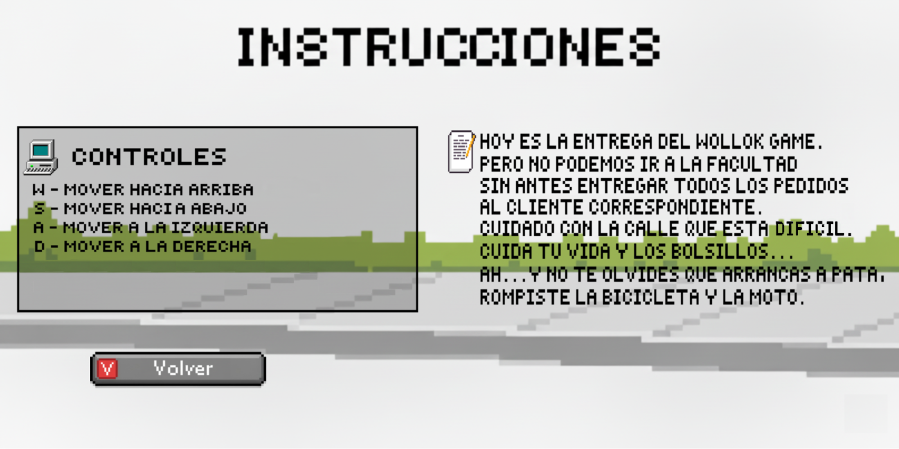
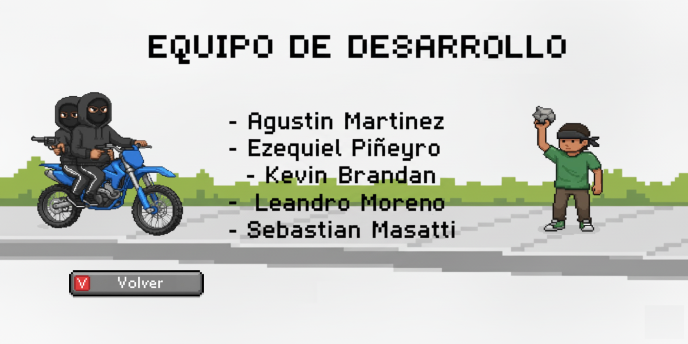
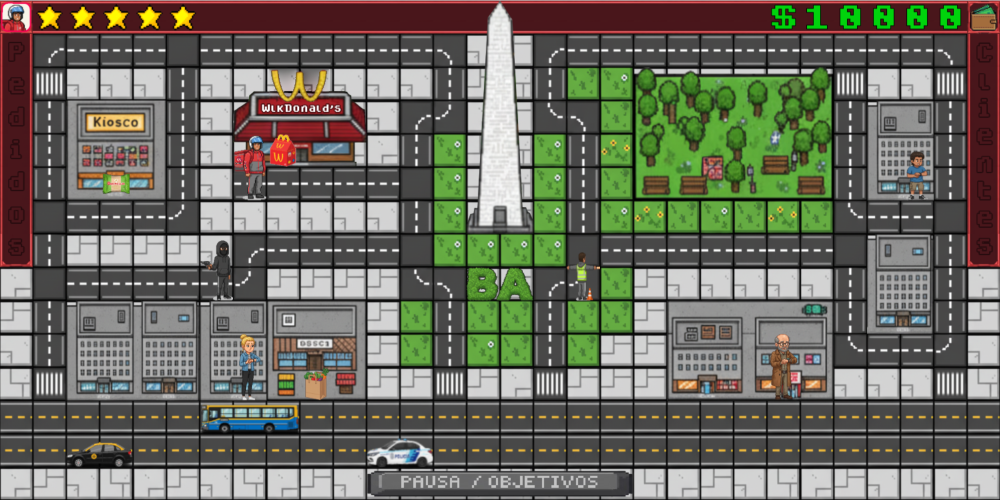
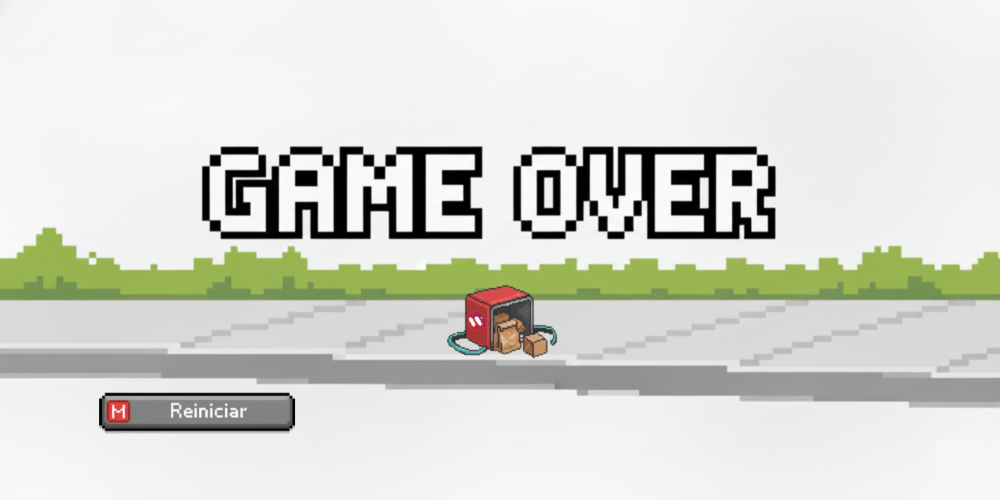
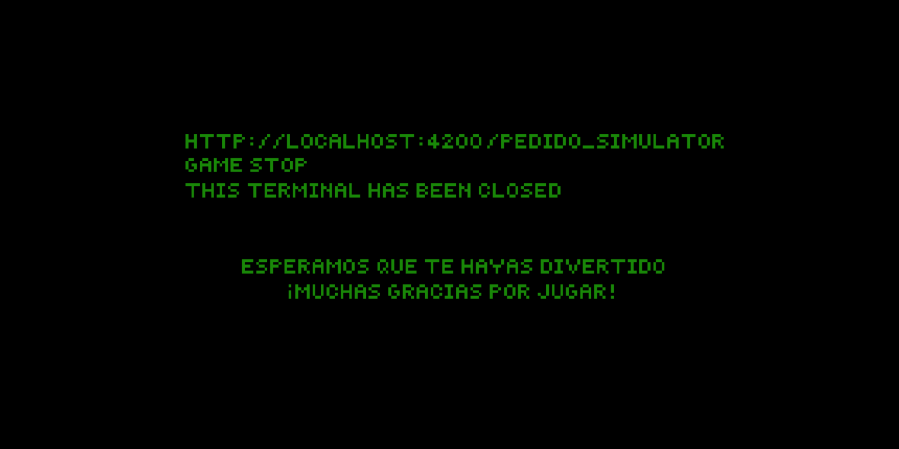

# Pedido Simulator

## Equipo de desarrollo

- Sebastián Masatti
- Agustin Martinez
- Ezequiel Piñeyro

## Capturas

## Reglas de Juego / Instrucciones

- W -> Mover hacía arriba
- S -> Mover hacía abajo
- A -> Mover hacía la izquierda
- D -> Mover hacía la derecha
- Espacio -> Pausa / Objetivos

Recoger los pedidos a traves del mapa y entregarselo al cliente correspondiente para ir avanzando entre niveles.

## Otros

- Programación con Objetos I - Comision 3 - 2do Cuatrimestre 2025
- Wollok 1.0.2
