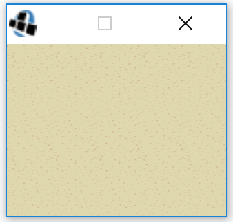
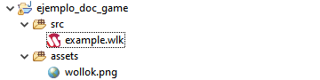
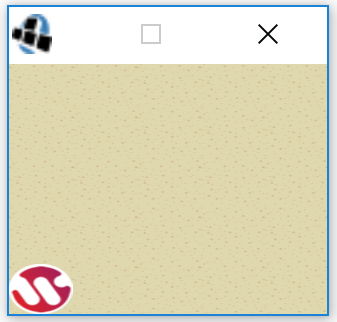
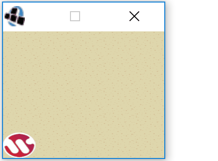
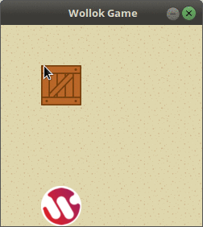
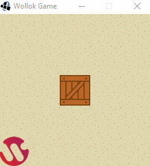
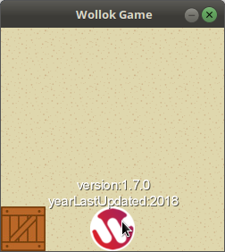
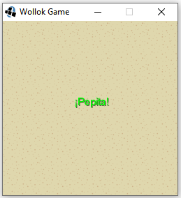
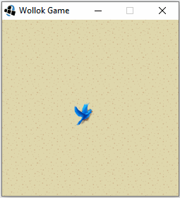
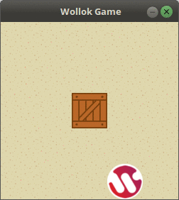

## ¿Que es?

Wollok-Game es una biblioteca de Wollok que sirve para crear juegos. La idea que propone es tener una especie de "tablero" en donde se puedan ubicar los objetos de algún programa de Wollok y éste se mostrará automáticamente en la pantalla.
A continuación se describe cómo utilizarlo y las funcionalidades que proporciona.

## El juego

El objeto más importante para interactuar con Wollok Game es el objeto `game` que para poder utilizarlo hay que importar la biblioteca _game_ de Wollok.
Se debe incluir al inicio de cada archivo (.wlk o .wpgm):

```wollok
import wollok.game.*
```

Para comenzar un juego, y poder visualizar el tablero, basta con indicar:

```wollok
game.start()
```

Se levantará una ventana independiente del sistema operativo mostrando el tablero.




## ¿Como se usa?


### Por consola ###

La forma más básica es importar Wollok Game desde la consola (sin archivo asociado) haciendo

```wollok
>>> import wollok.game.*
```

Y luego enviar los mensajes uno a uno, como habitualmente se usa la consola. 

```wollok
>>> game.start()
```

### Por consola, con archivo de codigo ###

Una forma frecuente es usar un archivo .wlk y definir allí el código inicial como cualquier otro código wollok válido, hacerlo ejecutar y enviar los mensajes por consola para que se realicen las acciones deseadas. 

Archivo ejemplo.wlk

```wollok
import wollok.game.*

object prueba{
  method iniciar(){
    game.start()
  }
}
```

Al ejecutar por consola este archivo, hacer

```wollok
>>> prueba.iniciar() 
```

### Con un programa

Otra forma de trabajar es creando un archivo .wpgm, o Wollok program, donde se define el código del juego, que se ejecuta directamente al ejecutar el archivo, sin abrir la consola.

Archivo ejemplo.wpgm

```wollok
import wollok.game.*

program ejemplo{
  game.start()
}
```

## El tablero
Todo el mundo de Wollok Game pasa por el tablero. Aquí es donde se van a agregar los objetos que queremos mostrar en el juego y tiene las siguientes características:

- Es **único**, de modo que solo podemos tener un tablero por juego
- Todo el tablero **está dividido en celdas** _cuadradas_ que se puede configurar usando `game.cellSize(px)` (por default: 50 x 50 px), y todas las posiciones del juego están en unidades de celdas (no se puede estar "en el medio" de una celda).
- Tiene un **título**, manejado por la propiedad `game.title()`
- Tiene un **ancho**, expresado en _cantidad de celdas_, manejado por la propiedad `game.width()`
- Tiene un **alto**, expresado en _cantidad de celdas_, manejado por la propiedad `game.height()`
- Tiene una **imagen de celda**, que se settea por medio de `game.ground(imagen)`, en donde `imagen` es un string con el nombre del archivo de la imagen.
 
### Ejemplo

```wollok
import wollok.game.*

program ejemplo {
  game.width(10)
  game.height(7)
  game.cellSize(50)
  game.title("Juego")
  game.start()
}
```

<div class="container text-center">
  
</div>

## Dibujando objetos

Ahora que sabemos cómo ver el tablero del juego, vamos a agregar objetos visuales para que interactúen. Para dibujar algún objeto en Wollok Game es necesario saber _qué imágen_ dibujar y _dónde en la pantalla_, para ello es necesario utilizar las **posiciones** y **visuales**.

### Las posiciones

Las **posiciones** son objetos que se encuentran en la biblioteca _game_ de Wollok y definen coordenadas x e y. La forma más simple de obtener una posición es pedírsela al **game** .

Por ejemplo, teniendo corriendo cualquier archivo `.wlk` que incluya el import de `wollok.game.*` se puede probar en al consola:

```wollok
>>> game.at(2,3)
2@3 // x = 2, y = 3 
>>> game.origin()
0@0
>>> game.center()
2@2 //-> Se calcula a partir del height y width
```

Las posiciones entienden mensajes para cada coordenada

```wollok
>>> game.at(2,3).x()
2
>>> game.at(2,3).y()
3
```

Para dibujar un objeto en una posición es necesario que entienda el mensaje `position()` y que retorne la posición en la que se quiere mostrar al objeto. Dicho método puede ser tan complejo o simple como se desee: puede tener una lógica específica que calcule la posición a partir de diversos factores o ser simplemente un método de acceso a una variable, en cuyo caso basta con definir `position` como propiedad.

```wollok
// Con propiedad
object wollok {
  var property position = game.origin()
}

// Con método 
object wollok {
  var property centrado = false
  method position() = if (centrado) game.center() else game.origin()
}
``` 

Pero para dibujar un objeto no es suficiente con definir en dónde mostrarlo. También debemos saber **qué** vamos a mostrar. Es decir, cuál será la _imagen_ de nuestro objeto.

### Visuales

Para elegir la imagen de un determinado objeto es necesario:

1. Tener una **carpeta fuente** en el proyecto Wollok **con todas las imágenes del juego**. Se puede crear haciendo _click derecho sobre el proyecto > Nueva > Otras... > Java > y buscan "Carpeta fuente"_. Luego pueden agregan las imágenes arrastrando / copiando como cualquier carpeta. El nombre de la carpeta suele ser _img_ o _assets_ por convención, pero es válido cualquier otro nombre. 
2. Agregar a tus objetos un método `image()` que **retorne el nombre del archivo de la imagen** como string, incluyendo la extensión. **Tené en cuenta que algunos sistemas operativos son case sensitive**, así que tené en cuenta mayúsculas y minúsculas.

#### Siguiendo con nuestro ejemplo anterior:

Su proyecto debería tener una estructura similar a la siguiente:



Y el código del objeto a mostrar podría ser

```wollok
object wollok {
  var property position = game.origin()

  method image() = "wollok.png"
}
```

### Agregando objetos al juego

Por último, para que el objeto se muestre en el tablero de juego, se debe hacer

```wollok
game.addVisual(wollok)
```

¡Ya podemos visualizar nuestros objetos en pantalla!



Así como existe `game.addVisual(objeto)`, también se puede hacer `game.removeVisual(objeto)` cuando queremos dejar de tenerlo en el juego.

### Otro ejemplo

La estructura del proyecto debería verse de la siguiente manera:

<div class="container text-center">
  
</div>
<br>

### En example.wlk

```wollok
import wollok.game.*
object caja {
  method image() = "caja.png"
  method position() = game.center()
} 
```

### Y al ejecutar

```wollok
>>> game.start()
>>> game.addVisual(caja)
```


>  AVISO IMPORTANTE : Wollok Game no hace ninguna modificación a las imágenes para mostrarlas. De modo que deberán tener el **tamaño** y **orientación** apropiado para tu juego.

-------

> **¿Cómo funciona?**
> Wollok game le consultará a los objetos cuál es la posición e imagen para mostrarlos _todo el tiempo_ (muchas veces por segundo). Esto significa que para que un objeto "se mueva" o "transforme su imagen" basta con hacer que responda cosas distintas a esos mensajes.


## Moviendo objetos

Una forma para que el objeto se mueva en el tablero es definiendo adecuacadamente el método `position()` y manipulando las referencias que se utilizan en él. 
Las posiciones son **objetos inmutables**, por lo que no se les puede cambiar sus coordenadas. Para ubicar objetos en posiciones diferentes se deben obtener nuevos objetos posición. 
En un caso simple, con una propiedad o un método que simplemente retorna la variable `position`, si modificamos la referencia a una posición diferente, el objeto se mueve a dicha ubicación.

```wollok
// Con propiedad
object wollok {
  var property position = game.origin()

  method centrar() {
    position = game.center()
  }

  method image() = "wollok.png"
}

// Con método 
object wollok {
  var centrado = false
  method position() = if (centrado) game.center() else game.origin()

  method centrar() {
    centrado = true
  }

  method image() = "wollok.png"
}

``` 

Las posiciones entienden los mensajes `right(c) left(c) up(c) down(c)` que devuelven nuevas posiciones con un desplazamiento de `c` casilleros en la dirección correspondiente. 

```wollok
object wollok {
  var property position = game.origin()

  method image() = "wollok.png"

  method subir() {
    position = position.up(1) 
  }

  // se mueve una determinada cantidad de posiciones en diagonal principal
  method enDiagonal(cantidadPosiciones) { 
    position = position.up(cantidadPosiciones).right(cantidadPosiciones) 
  }

}
```

## El personaje

Wollok Game te permite tener un _personaje especial_ y le da la capacidad de **moverlo con las flechas del teclado**. Basta con decirle al juego cuál objeto es el personaje a la hora de dibujarlo. 
El objeto debe entender los mensajes `position()` y `position(nuevaPosition)`, lo que puede sustituirse definiendo `position` como propiedad. 

```wollok 
game.addVisualCharacter(wollok)
```



## ¡Tambien hablan!

Así es, **los objetos del juego pueden hablar**. Para eso hay que indicar el `objeto` del juego y el `texto` que dirá por medio del mensaje `game.say(objeto, texto)`:

```wollok
game.say(wollok, wollok.howAreYou())
```


## Un juego interactivo

Ya podemos mostrar nuestros objetos en el tablero, dónde y con la imagen que queramos. Ahora falta poder interactuar con el juego para que sea divertido.

### Colisiones

Una forma de hacer que tus objetos interactúen entre sí es por medio de colisiones. Estos son **bloques de código** que se agregan a un objeto del tablero y se ejecutará cuando otro objeto _colisione_ con éste (ocupe la misma posición). `game.whenCollideDo(objeto, accionConColisionado)`.

#### Ejemplo


#### En example.wpgm

```wollok
import wollok.game.*

object wollok {
  var property position = game.origin()
  method howAreYou() = "I am Wolloktastik!"
  method image() = "wollok.png"
}

object caja {
  var property position = game.center()
  method image() = "caja.png"
  method subir(){
    position = position.up(1)
  }
}

program ejemplo {
  game.addVisualCharacter(wollok)  //Para que se pueda mover con las flechas
  game.addVisual(caja)
  // Apenas el personaje wollok colisione con la caja, el personaje habla y la caja se desplaza
  game.whenCollideDo(wollok, { elemento => 
    elemento.subir()
    game.say(wollok,wollok.howAreYou())
  })
  game.start()
}
```

**Tip:** si necesitás esa imagen la podés descargar en el directorio assets del ejemplo [sokoban](https://github.com/wollok/sokobanGame)

### Eventos automaticos

Una funcionalidad interesante que podemos implementar es que **la caja se mueva cada n segundos** (por ejemplo, cada 2 segundos), enviando el mensaje `onTick()` al objeto `game`, el lapso de repetición expresado en milisegundos, un identificador (string descriptivo) y el bloque de código que debe ejecutar:

```wollok
program ejemplo {
  game.addVisualCharacter(wollok)
  game.addVisual(caja)
  // cada dos segundos muevo la caja
  game.onTick(2000, "movimiento", { caja.movete() })
  //
  game.start()
}
```

El método `movete()` en caja actualiza la posición en base a un valor al azar, tomando en cuenta el ancho y alto del tablero:

```wollok
object caja {
  var property position = game.center()
  method image() = "caja.png"
  method movete() {
    const x = 0.randomUpTo(game.width()).truncate(0)
    const y = 0.randomUpTo(game.height()).truncate(0)
    // otra forma de generar números aleatorios
    // const x = (0.. game.width()-1).anyOne() 
    // const y = (0.. game.height()-1).anyOne() 
    position = game.at(x,y) 
  }
}
```

Cuando ejecutamos el programa, vemos cómo la caja cada 2 segundos cambia de posición (y wollok debe andar con más cuidado):



¿Y si queremos definir un evento que suceda una sola vez? También podemos hacerlo, enviando el mensaje `schedule(miliseconds, action)` al objeto `game` de la siguiente manera:

```wollok
program ejemplo {
	game.schedule(3000, { game.say(wollok, "¡Hola!") })
	game.start()
}
```



Veremos otras aplicaciones más adelante.

### Eventos del teclado

Wollok Game permite capturar todos los eventos del teclado, para lo cual te recomendamos que leas la documentación del objeto autodefinido `keyboard`. En particular, podés definir qué tiene que pasar cuando un usuario presione una tecla. 
Así, un _ENTER_ podría hacer que el personaje salude, y la tecla _p_ que el movimiento de la caja se detenga.

```wollok
import wollok.game.*

program ejemplo {
  game.addVisualCharacter(wollok)
  game.addVisual(caja)
  
  game.onTick(2000, "movimiento",{ caja.movete() })

  // capturamos el evento ENTER del teclado
  keyboard.enter().onPressDo { game.say(wollok, wollok.howAreYou()) }
  // capturamos el evento de presionar la tecla p del teclado
  keyboard.p().onPressDo { game.removeTickEvent("movimiento") }  // Mensaje que detiene la acción repetitiva indicada
  game.start()
}
```

### Mostrar atributos de los objetos visuales ###

Incorporemos los siguientes atributos al objeto visual wollok:

```wollok
object wollok {
  var property position = game.origin()
  var version = "1.7.0"
  var lastUpdated = new Date()

  method image() = "wollok.png"
}
```

También agregamos en el programa la configuración para ver las referencias de los objetos visuales (por defecto esta opción está deshabilitada):

```wollok
program ejemplo {
  game.addVisualCharacter(wollok)
  game.showAttributes(wollok)
	// etc.
```

Esto hace que cuando paremos el mouse sobre dicho objeto, veamos su estado interno:



Si no queremos deshabilitarlo una vez activado (porque nos distrae tanta información en el tablero), podemos enviar el mensaje `hideAttributes()` a `game` indicando cuál es el objeto visual al que no queremos que se le vean los atributos:

```wollok
program ejemplo {
  game.addVisualCharacter(wollok)
  //...
  game.hideAttributes(wollok)
}
```

## Cambiando el fondo ##

Es posible modificar el fondo de nuestro tablero, para lo cual podés buscar cualquier imagen que te guste, como [ésta](https://www.todopaisajes.com/fondos-de-pantalla-de-playas). Lo descargamos en una carpeta fuente de nuestro proyecto.

En el programa agregamos el mensaje correspondiente al objeto game:

```wollok
import wollok.game.*

program ejemplo {
  game.width(10)
  game.height(10)
  game.boardGround("playa.jpg") // o el nombre con el que lo hayas bajado
  game.start()
}
```

Esto produce que en el tablero se visualice la imagen de fondo: 


De aquí en más volveremos con el fondo convencional para que distraiga menos la atención.

## Dibujando textos

¿Se acuerdan que dijimos que para dibujar un objeto era necesario definir su imagen? Bueno, esto no es del todo cierto. Es posible mostrar solamente texto. 

Para ello es necesario agregarle a nuestro objeto un método `text()` **que devuelva el texto a mostrar** como string. Es importante definir la posición en la cual se debe mostrar de la misma manera que lo hacíamos antes. El objeto puede no tener el método `image()`.

### Ejemplo

```wollok
import wollok.game.*

object pepita {
	
	method position() = game.center()
	
	method text() = "¡Pepita!"
}
```

Al correr el siguiente programa:

```wollok
import wollok.game.*
import pepita.*

program ejemplo {

	game.addVisual(pepita)
	game.start()

}
```

Deberíamos poder ver el texto _¡Pepita!_ escrito en el medio del tablero:


El color por defecto es **azul**, pero se puede modificar.

### Coloreando textos

Para poder cambiar el color del texto debemos agregarle a nuestro objeto un método `textColor()` que debe devolver un string con un valor RGBA en hexa.

¿Qué es un valor RGBA? Es una forma de representar colores mediante la composición de rojo, verde y azul. Además, se agrega información sobre la opacidad. Para más información pueden visitar [esta página](https://rgbacolorpicker.com/). Explica con más detalle de qué se trata y además les genera un valor RGBA a partir del color que ustedes quieran.

¿Cómo lo convierto a hexa? Muy fácil. Pueden utilizar cualquier página que, dado un valor RGBA, lo convierta en hexa. Les dejamos [esta página](https://rgbatohex.com/) como ejemplo.

### Ejemplo

```wollok
import wollok.game.*

object paleta {
	const property verde = "00FF00FF"
	const property rojo = "FF0000FF"
}

object pepita {
	
	method position() = game.center()
	
	method text() = "¡Pepita!"
	
	method textColor() = paleta.verde()
}
```

Corriendo el mismo programa anterior deberíamos poder ver:



### Imagenes con texto

¡Podemos combinar textos con imágenes! Para ello necesitamos que nuestro objeto defina qué _imagen_ va a mostrar, de la misma manera que veníamos haciendo antes. El texto siempre se dibujará por encima de la imagen.

### Ejemplo

```wollok
import wollok.game.*

object paleta {
	const property verde = "00FF00FF"
	const property rojo = "FF0000FF"
}

object pepita {
	
	method position() = game.center()
	
	method image() = "pepita.png"
	
	method text() = "¡Pepita!"
	
	method textColor() = paleta.verde()
}
```

Corriendo el mismo programa anterior deberíamos poder ver:


## Objetos invisibles

También es posible definir objetos invisibles y agregarlos al tablero. Nos pueden servir, por ejemplo, para disparar colisiones. Es importante que estos objetos **no definan** los métodos `text()` e `image()`.

### Ejemplo

```wollok
import wollok.game.*

object pepita {
	
	var property position = game.center()
	
	method image() = "pepita.png"
}

object invisible {
	
	method position() = game.origin()
}
```

Al correr el siguiente programa:

```wollok
import wollok.game.*
import pepita.*

program ejemplo {

	game.addVisualCharacter(pepita)
	game.addVisual(invisible)
	game.onCollideDo(invisible, {elemento => game.say(invisible, "¡Cuidado!")})
	game.start()
}
```

Deberíamos poder observar que cuando pepita pasa por el origen, el objeto invisible le dice: ¡Cuidado!



## Sonidos

¡Podemos reproducir sonidos! Para ello podemos pedirle un sonido a game, enviándole el mensaje: `game.sound(audioFile)`. El parámetro es el path al archivo de audio que quieren reproducir. Las extensiones aceptadas son: *.mp3, .ogg o .wav*.

Al igual que las imágenes, podemos guardar nuestros sonidos dentro de la carpeta `assets`.

¿Qué podemos hacer con un sonido? Podemos reproducirlo enviándole el mensaje `play`.

### Ejemplo

```wollok
import wollok.game.*

object waterDrop {
	
	method play(){
		game.sound("water-drop-sound.mp3").play()
	}
}

program soundProgram {

	keyboard.enter().onPressDo({waterDrop.play()})
	game.start()

}
```

Cada vez que apretemos la tecla `enter` se reproducirá nuestro sonido.

**Importante:** los sonidos pueden reproducirse sólo una vez. Si queremos hacerlo de nuevo es necesario crear otro sonido.

### Sonido de fondo

También podemos definir música de ambiente o un sonido de fondo para el juego. Esto lo logramos enviándole el mensaje `shouldLoop(true)` al sonido.


```wollok
import wollok.game.*

program soundProgram {
	
	const rain = game.sound("light-rain.mp3")
	rain.shouldLoop(true)
	game.schedule(500, { rain.play()} )
	game.start()
}
```

**Importante:** los sonidos sólo pueden reproducirse si el juego ya inició. Es por eso que debemos *planificar* su reproducción si queremos que suceda de manera automática al iniciar el juego.

### Pausar

Otras cosas que podríamos querer hacer con los sonidos es pausarlos, reanudarlos y detenerlos por completo. Para ello existen los mensajes `pause()`, `resume()` y `stop()` que entienden los sonidos.

```wollok
import wollok.game.*

program soundProgram {
	
	const rain = game.sound("light-rain.mp3")
	rain.shouldLoop(true)
	keyboard.p().onPressDo({rain.pause()})
	keyboard.r().onPressDo({rain.resume()})
	keyboard.s().onPressDo({rain.stop()})
	game.schedule(500, {rain.play()})
	game.start()
}
```

Esto nos permite *pausar* la lluvia con la letra **p**, volver a *reproducirla* con la letra **r** y *detenerla* con la letra **s**.

### Volumen

Por último queríamos mostrarles que los sonidos también tienen su propio volumen y son independientes unos de otros. Podemos consultarlo enviando el mensaje `volume()` a un sonido y también podemos modificarlo si así lo deseamos, mediante `volume(newVolume)`.

```wollok
import wollok.game.*

program soundProgram {
	
	const rain = game.sound("light-rain.mp3")
	rain.shouldLoop(true)
	keyboard.up().onPressDo({rain.volume(1)})
	keyboard.down().onPressDo({rain.volume(0)})
	keyboard.m().onPressDo({rain.volume(0.5)})
	game.schedule(500, {rain.play()})
	game.start()
}
```

En el ejemplo mostramos cómo podemos *mutear* un sonido presionando la tecla **down**, llevarlo a su máximo volumen con la tecla **up** y dejarlo en un valor intermedio presionando la tecla **m**.

## Testing

En este apartado mostraremos algunas consideraciones que deberán  tener en cuenta a la hora de hacer tests con `wollok game`. Pero antes de comenzar, les recomendamos que lean los apuntes sobre testing: [Introducción al testeo unitario automatizado](https://docs.google.com/document/d/1Q_v48gZfRmVfLMvC0PBpmtZyMoALbh11AwmEllP__eY/edit?usp=drive_web) y [Testeo unitario automatizado avanzado](https://docs.google.com/document/d/1caDE_mlP1QMfzyVpyvh-tKshjAeYLXBkXDYrTX5zFUI/edit#?usp=drive_web).

### Game mantiene su estado

Es probable que quieran agregar elementos al tablero para probar cierta funcionalidad mediante su interacción o movimiento. Pero, si agregan un elemento en un test, este mismo vivirá en los demás. Esto es problemático y puede romper sus tests.

Para solucionarlo pueden enviarle el mensaje `clear()` al objeto `game`, de manera que el juego se limpie y quede libre de objetos. Pero, ¿dónde haríamos eso? Dentro del método `initialize()` del `describe`. De esta manera, nos aseguramos que `game` se reinicie antes de correr cada uno de nuestros tests.

```wollok
import wollok.game.*

describe "Mi describe" {

  method initialize(){
    game.clear()
    // Hago otras cosas...
  }

  test "Mi primer test" {
    game.addVisual(miVisual)
    ...
  }

  test "Mi segundo test"{
    game.addVisual(otroVisual)
    ...
  }
}
```

### Reproduccion de sonidos

Ya vimos que los sonidos no se pueden reproducir si el juego no empezó. Y en los tests no nos interesa iniciar el juego. Entonces, ¿qué sucede si alguna funcionalidad que queramos testear reproduce un sonido por atrás? Se lanza una excepción y el test falla.

Solucionar esto es un poco más complicado porque requiere de varios cambios. En un principio, el problema empieza cuando le enviamos el mensaje `play()` a un sonido. Lo que podríamos hacer es cambiar estos sonidos por otros objetos polimórficos que los "imiten". Es decir, estos nuevos objetos entenderán todos los mensajes que entienden los sonidos y cuando les mandemos el mensaje `play()` no harán nada. De esta manera no se lanzará una excepción y los test podrán pasar.

```wollok
object soundMock {
	
	method pause(){}
	
	method paused() = true
	
	method play(){}
	
	method played() = false
	
	method resume(){}
	
	method shouldLoop(looping){}
	
	method shouldLoop() = false
	
	method stop(){}
	
	method volume(newVolume){}
	
	method volume() = 0
}
```

Pero los sonidos se los pedimos al objeto `game()`. Entonces, tenemos que cambiar el objeto al cual le pedimos los sonidos. Vamos a crear un nuevo objeto que se va a encargar de crearlos por nosotros. Lo llamaremos `soundProducer`. Dicho objeto, en un principio, se lo pedirá a `game` porque necesitamos los sonidos de verdad. Lo interesante es que vamos a poder intercambiar a quién le pide los sonidos. Entonces, podemos tener otro objeto que nos de los sonidos "de mentira" para poder hacer nuestros tests. A este último lo llamaremos `soundProviderMock`. Bajando esto a tierra, podríamos tener algo como lo siguiente:

```wollok
import wollok.game.*

object soundProducer {
	
	var provider = game
	
	method provider(_provider){
		provider = _provider
	}
	
	method sound(audioFile) = provider.sound(audioFile)
	
}

object soundProviderMock {
	
	method sound(audioFile) = soundMock
	
}
```

En nuestro código vamos a tener que modificar todos los lugares donde le pedíamos un sonido a `game`. Es decir, reemplazaremos `game.sound(audioFile)` por `soundProducer.sound(audioFile)` (o el nombre que ustedes hayan elegido).

¿Y qué ganamos con esto? En el `describe` de nuestros tests vamos a poder configurar el proveedor de sonidos dentro del método `initialize()`, similar al caso anterior. Esto nos permitirá usar sonidos "de mentira" para que no rompan nuestros tests.

```wollok
describe "Mi describe" {

  method initialize(){
    soundProducer.provider(soundProviderMock)
    // Hago otras cosas...
  }

  test "Mi primer test" {
    ...
  }
}
```

## Reportando errores

Cuando las cosas no salen como queremos y ocurre un error, el personaje especial es el que nos lo cuenta. Supongamos que modificamos el bloque que trabaja la colisión entre nuestro personaje wollok y la caja:

```wollok
program ejemplo {
  game.addVisualCharacter(wollok)  
  game.addVisual(caja)
  game.whenCollideDo(wollok, { elemento => 
    const a = 1 / 0 //Se produce un error
  })
  game.start()
}
```

lo que pasa es que ocurre un error, y wollok es el que nos informa:



Por defecto, si hay un personaje es éste el responsable de avisar los errores que ocurren en el juego, y en caso de no haber personaje será cualquier objeto visual que esté en el tablero.

Igualmente nosotros podemos decirle que otro sea el objeto que reporte los errores de Wollok Game, como la caja:

```wollok
program ejemplo {
  //...
  game.errorReporter(caja)
  //...
}
```

Entonces cuando hay un error en un bloque de código que maneja Wollok Game, será la caja la que nos esté reportando un error:


## Para seguirla ##

El código de los ejemplos mencionados está en [este repositorio](https://github.com/wollok/ejemploGameSite).

También podés investigar [todos estos ejemplos](https://github.com/wollok?utf8=%E2%9C%93&q=game&type=&language=) en el repositorio de Wollok. ¡Que lo disfrutes!
