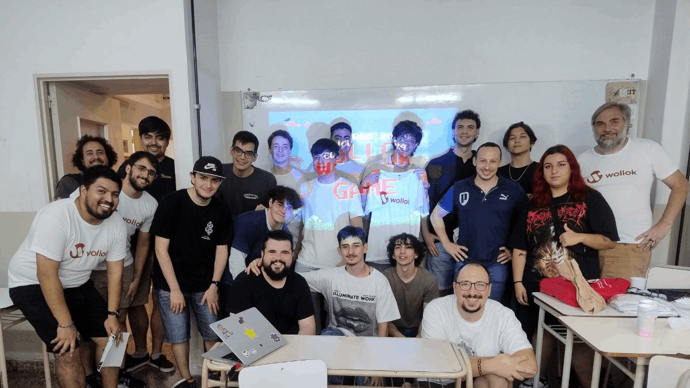

On Saturday, December 14th, we gathered at UTN to announce the winners and hand out the prizes!

## Podium
##### 1st Prize &#x1F947; - _Sticky Blocks_
##### 2nd Prize &#129352; - _DeSvARiaDoS_
##### 3rd Prize &#129353; - _Sin Retorno: Wollok Version_

## Special Mentions
##### Most Creative Adaptation - _Magos vs Slimes: La comunidad de la papa_
##### Most Original - _Loop_
##### Most Argentine - _Argentopolis_

## Games
18 games participated from 3 different universities

    <ol class="list-group">
        <li class="list-group-item"><a href="https://github.com/AlexisF12/Proyecto-wollok">El Eternauta</a>
            <a href="https://xtext.wollok.org/">(in Xtext)</a>
        </li>
        <li class="list-group-item"><a href="https://github.com/pdepjm/2024-o-tpjuego-bestiasalgoritmicas">Sticky Blocks</a>
            <a href="/concurso/2024-o-tpjuego-bestiasalgoritmicas">(Try it here)</a>
        </li>
        <li class="list-group-item"><a href="https://github.com/pdepjm/2024-o-tpjuego-vmsl">Wollok Diner</a>
            <a href="/concurso/2024-o-tpjuego-vmsl">(Try it here)</a>
        </li>
        <li class="list-group-item"><a href="https://github.com/pdepjm/2024-o-tpjuego-fundamentalistasdelstackoverflow">La bizarra aventura de Morcilla</a>
            <a href="/concurso/2024-o-tpjuego-fundamentalistasdelstackoverflow">(Try it here)</a>
        </li>
        <li class="list-group-item"><a href="https://github.com/CristianEGonzalez/Argentopolis-ts-WollokGame">Argentopolis</a>
            <a href="/concurso/Argentopolis-ts-WollokGame">(Try it here)</a>
        </li>
        <li class="list-group-item"><a href="https://github.com/obj1-unahur-2024s2/TPGameIntegrador-thecoders">Wololok</a>
            <a href="/concurso/TPGameIntegrador-thecoders">(Try it here)</a>
        </li>
        <li class="list-group-item"><a href="https://github.com/obj1-unahur-2024s2/TPGameIntegrador-los-stormtrooper">Sin Retorno -Wollok Version-</a>
            <a href="/concurso/TPGameIntegrador-los-stormtrooper">(Try it here)</a>
        </li>
        <li class="list-group-item"><a href="https://github.com/pdepjuevesTT/2024-tpo-game-matrixgroup">Wollok Factory</a>
            <a href="/concurso/2024-tpo-game-matrixgroup">(Try it here)</a>
        </li>
        <li class="list-group-item"><a href="https://github.com/alymarquez/FroguiWollokGame">Frogui</a>
            <a href="https://xtext.wollok.org/">(in Xtext)</a>
        </li>
        <li class="list-group-item"><a href="https://github.com/obj1-unahur-2024s1/TPGameIntegrador-pixelados">Ahorcado</a>
            <a href="https://xtext.wollok.org/">(in Xtext)</a>
        </li>
        <li class="list-group-item"><a href="https://github.com/IRojas99/LoopGame">Loop</a>
            <a href="https://xtext.wollok.org/">(in Xtext)</a>
        </li>
        <li class="list-group-item"><a href="https://github.com/obj1-unahur-2024s2/TPGameIntegrador-wollokoders">Memotest Copa América 2024</a>
            <a href="/concurso/TPGameIntegrador-wollokoders">(Try it here)</a>
        </li>
        <li class="list-group-item"><a href="https://github.com/juancamargo02/MazeOfCrete">Maze of Crete</a>
            <a href="https://xtext.wollok.org/">(in Xtext)</a>
        </li>
        <li class="list-group-item"><a href="https://github.com/obj1-unahur-2024s2/TPGameIntegrador-las-chicas-y-leo">Ghost Coffee</a>
            <a href="/concurso/TPGameIntegrador-las-chicas-y-leo">(Try it here)</a>
        </li>
        <li class="list-group-item"><a href="https://github.com/pdepjm/2024-o-tpjuego-ahmeestancodeando">Magos vs Slimes: La comunidad de la papa</a>
            <a href="/concurso/2024-o-tpjuego-ahmeestancodeando">(Try it here)</a>
        </li>
        <li class="list-group-item"><a href="https://github.com/obj1unq/2024s2-tp-grupal-juego-grupo-1-uwu">DeSvARiaDoS</a>
            <a href="/concurso/2024s2-tp-grupal-juego-grupo-1-uwu">(Try it here)</a>
        </li>
        <li class="list-group-item"><a href="https://github.com/obj1-unahur-2024s2/TPGameIntegrador-los-polimorficos">Las Aventuras de Coco</a>
            <a href="/concurso/TPGameIntegrador-los-polimorficos">(Try it here)</a>
        </li>
        <li class="list-group-item"><a href="https://github.com/pdepjm/2024-o-tpjuego-laalmironeta">PokeWollok</a>
            <a href="/concurso/2024-o-tpjuego-laalmironeta">(Try it here)</a>
        </li>
    </ol>

