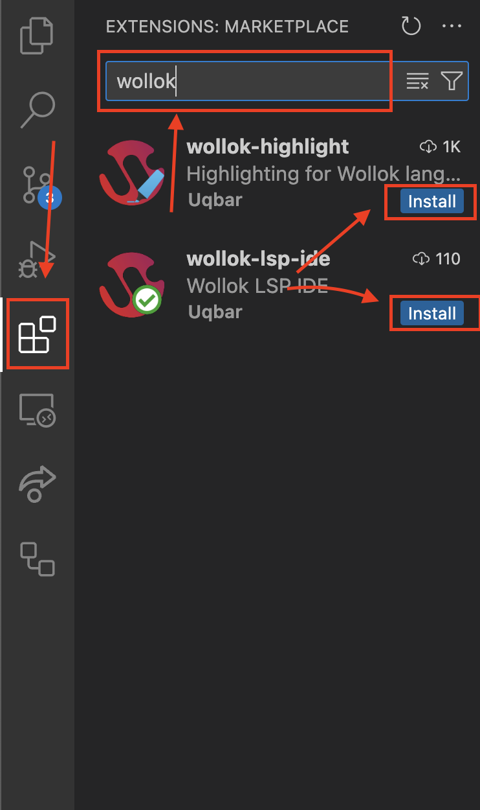

## Pre-requisitos

Para poder usar Wollok es necesario:

1. Tener instalado [VSCode](https://code.visualstudio.com/).

1. Descargar la _Wollok Command Line Interface_ (CLI) disponible para [Linux](https://github.com/uqbar-project/wollok-ts-cli/releases/latest/download/wollok-ts-cli-linux-x64), [MacOS](https://github.com/uqbar-project/wollok-ts-cli/releases/latest/download/wollok-ts-cli-macos-x64) (versión [arm64](https://github.com/uqbar-project/wollok-ts-cli/releases/latest/download/wollok-ts-cli-macos-arm64)) y [Windows](https://github.com/uqbar-project/wollok-ts-cli/releases/latest/download/wollok-ts-cli-win-x64.exe).
También recomendamos agregarlo a la variable de entorno PATH (acá hay instrucciones para [Linux](https://unix.stackexchange.com/questions/183295/adding-programs-to-path), [Mac](https://apple.stackexchange.com/questions/41542/adding-a-new-executable-to-the-path-environment-variable) y [Windows](https://medium.com/@kevinmarkvi/how-to-add-executables-to-your-path-in-windows-5ffa4ce61a53)).

## Instalación

1. **Abrir el VSCode**

1. Instalar las extensiones [`wollok-lsp-ide`](https://marketplace.visualstudio.com/items?itemName=uqbar.wollok-lsp-ide) y [`wollok-highlight`](https://marketplace.visualstudio.com/items?itemName=uqbar.wollok-highlight) disponibles en los links o directamente desde el _Marketplace_ del VSCode.
Podés ir a la tab de Extensiones y buscar por Wollok como muestra esta imagen: 

1. Si todo salió bien
Deberías poder ver ambas extensiones instaladas en tu VSCode: 

## Configuración 

Ahora es necesario **configurar la extensión** para que pueda usar _Wollok-CLI_ para correr programas. 

1. Ir a la pestaña de "ajustes" (o "settings" en inglés) del VSCode: `Ctrl + ,` o desde el menú: `Code -> Preferencias -> Ajuestes`. Y buscar por `"Wollok"`. 

1. El primer ajuste que aparecerá es para indicar el _path_ donde se encuentra Wollok Command Line Interface (CLI). Para eso es necesario copiar **la dirección _absoluta_ del ejecutable que te descargaste antes** y pegarlo en el campo.
> ATENCIÓN ⚠️
> Este paso es necesario para poder ejecutar código.

1. También hay otras configuraciones, como seleccionar el idioma en que querés que se muestren los mensajes de errores. 

1. Al final debería verse algo así:

**¡Listo!** 

Ya deberías poder usar VSCode con Wollok.

## Próximos pasos

¿Cómo seguimos?

- Podés ver cómo [crear un proyecto Wollok de cero](/website-wollok-ts/getting_started/new_project).
- Si ya tenés un proyecto Wollok en tu VSCode te recomendamos hacer el [Tour por las herramientas que soportamos](/website-wollok-ts/tour) para sacarle todo el potencial al IDE.
- Si tenés dudas sobre algo del lenguaje podés [ir a la documentación](/website-wollok-ts/documentation).
