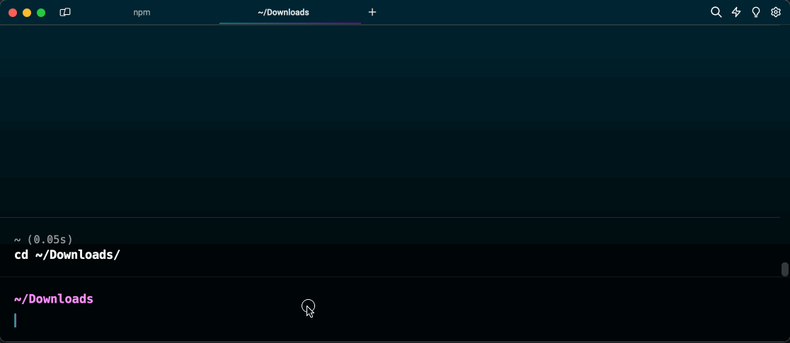

## Pre-requisitos

Tener instalado [VSCode](https://code.visualstudio.com/).

## Wollok Command Line Interface

1. Descargar la _Wollok Command Line Interface_ (CLI) disponible para [Linux](https://github.com/uqbar-project/wollok-ts-cli/releases/latest/download/wollok-ts-cli-linux-x64), [MacOS](https://github.com/uqbar-project/wollok-ts-cli/releases/latest/download/wollok-ts-cli-macos-x64) (versión [arm64](https://github.com/uqbar-project/wollok-ts-cli/releases/latest/download/wollok-ts-cli-macos-arm64)) y [Windows](https://github.com/uqbar-project/wollok-ts-cli/releases/latest/download/wollok-ts-cli-win-x64.exe).

2. Luego vamos a **renombrar el ejecutable** a wollok (o wollok.exe) para facilitar su uso desde una terminal y **lo ubicaremos dentro del PATH de nuestro sistema operativo** para que lo reconozca desde cualquier carpeta. A continuación te dejamos las instrucciones para cada caso.

### Windows

- Para este punto vamos a levantar una terminal Powershell (lo ideal es que sea versión 7 ó posterior, pero también te va a funcionar con la versión 5). Podés buscar en la barra de herramientas y seleccionar la opción **Powershell 7 (x64)**

- Luego hay que ejecutar los siguientes pasos, asumiendo que en la carpeta `Downloads` del usuario logueado te descargaste la versión de Windows

```powershell
cd .\Downloads
ls ./wollok-ts-cli*
mv ./wollok-ts-cli* ./wollok.exe
# ya podés verificar que funciona
./wollok --version
```


> La versión que muestre será la última que te hayas descargado (no tiene que ser 0.2.2)

- Ahora vamos a hacer que ese ejecutable sea accesible desde cualquier carpeta, para lo cual, nos paramos nuevamente en nuestra carpeta raíz de usuario (en nuestro caso es `C:/Users/Usuario`) y copiamos el ejecutable en una nueva carpeta `Wollok`

```powershell
mkdir Wollok
mv ./Downloads/wollok.exe ./Wollok
ls ./Wollok       # verificamos que esté el ejecutable Wollok
```


Y por último vamos a agregar la carpeta Wollok que acabamos de crear a la lista de carpetas que forman parte de nuestro PATH. Para eso abrimos la configuración de variables de entorno (TODO: contar el paso a paso):


Ahora sí, nos posicionamos en una carpeta diferente a `C:/Users/Usuario/Wollok` y ejecutamos `wollok --version`:

TODO: grabar video

### Linux

- Para este punto vamos a necesitar levantar una terminal con `Ctrl + Alt + T` o buscando `Terminal` en la barra de herramientas

- Asumimos que descargaste la versión del cli en la carpeta `~/Downloads` (`~` es la carpeta raíz del usuario logueado). Desde aquí vamos a renombrar el archivo ejecutable y le vamos a dar permisos de ejecución:

```bash
cd ~/Downloads
ls -la wollok-ts-cli*
mv ./wollok-ts-cli* ./wollok
chmod a+x ./wollok
sudo mv ./wollok /usr/local/bin/wollok # te va a pedir la clave de usuario root
ls -la /usr/local/bin/wollok
```

Te mostramos cómo se hace esta parte desde una terminal:


Lo que hacemos es renombrar el archivo a `wollok`, darle permisos de ejecución (`chmod a+x`), pasarlo a la carpeta `/usr/local/bin` y confirmar con `ls -la` que el archivo está en ese directorio. El archivo debe tener las tres `x` correspondientes a los permisos de ejecución.

Para verificar que está correctamente instalado, escribimos `wollok --version` en la consola desde cualquier carpeta, y nos debe devolver el número de versión (también podemos ejecutar `wollok --help`):


> La versión que muestre será la última que te hayas descargado (no tiene que ser 0.2.2)

### Mac

- Para este punto vamos a necesitar levantar una terminal con `⌘ (Cmd) + Espacio` o buscando `Terminal` en el Launchpad

- Asumimos que descargaste la versión del cli en la carpeta `~/Downloads` (`~` es la carpeta raíz del usuario logueado). Desde aquí vamos a renombrar el archivo ejecutable y le vamos a dar permisos de ejecución:

```bash
cd ~/Downloads
ls -la wollok-ts-cli*
mv ./wollok-ts-cli* ./wollok
chmod a+x ./wollok
sudo mv ./wollok /usr/local/bin/wollok # te va a pedir la clave de usuario root
ls -la /usr/local/bin/wollok
```

Te mostramos cómo se logra desde una terminal [Warp](https://www.warp.dev/) de Mac, es exactamente igual que si lo hacés desde una terminal común.



Lo que hacemos es renombrar el archivo a `wollok`, darle permisos de ejecución (`chmod a+x`), pasarlo a la carpeta `/usr/local/bin` y confirmar con `ls -la` que el archivo está en ese directorio. El archivo debe tener las tres `x` correspondientes a los permisos de ejecución.

Para verificar que esté correctamente instalado, ecesitamos algunos pasos más gracias al mecanismo de seguridad que trae el sistema operativo Mac:

- debemos ejecutar `wollok --version` la primera vez
- va a aparecer una ventana avisando que no puede ejecutarlo, hacemos click en la opción `Show in Finder`
- en el Finder hacemos click derecho y en las opciones, nuevamente Open
- eso abre una Terminal (en nuestro caso no es la que estamos usando, por eso aparece una nueva ventana), y una **nueva ventana de confirmación**. Esta vez en lugar de `Show in Finder` seleccionamos `Open`
- la parte buena es que una vez que ejecuta desde esa terminal, ya podemos utilizarlo normalmente. Cerramos la terminal que nos abrió Mac y volvemos a nuestra terminal original
- ejecutamos nuevamente `wollok --version` y ahora sí funciona correctamente


> La versión que muestre será la última que te hayas descargado (no tiene que ser 0.2.2)


## Extensiones de Wollok

1. **Abrir el VSCode**

2. Instalar las extensiones [`wollok-lsp-ide`](https://marketplace.visualstudio.com/items?itemName=uqbar.wollok-lsp-ide) y [`wollok-highlight`](https://marketplace.visualstudio.com/items?itemName=uqbar.wollok-highlight) disponibles en los links o directamente desde el _Marketplace_ del VSCode. El orden en el que instales las extensiones es indistinto.

Podés ir a la tab de Extensiones, buscar 'wollok' e instalarlas como muestra esta imagen:


3. Si todo salió bien deberías poder ver ambas extensiones instaladas en tu VSCode:


## Configuración

Ahora es necesario **configurar la extensión** para que pueda usar _Wollok-CLI_ para correr programas.

1. Ir a la pestaña de "ajustes" (o "settings" en inglés) del VSCode: `Ctrl + ,` o desde el menú: `Code -> Preferencias -> Ajustes`. Y buscar por `wollok`.

2. El primer ajuste que aparecerá es para indicar el _path_ donde se encuentra Wollok Command Line Interface (CLI). Para eso es necesario 1. utilizar el nombre "wollok" si seguiste los pasos de instalación o bien 2. copiar **la dirección _absoluta_ del ejecutable que te descargaste antes** y pegarlo en el campo.

> ATENCIÓN ⚠️
> Este paso es necesario para poder ejecutar código.

3. También hay otras configuraciones, como seleccionar el idioma en que querés que se muestren los mensajes de errores.

4. Al final debería verse algo así:


**¡Listo!**

Ya deberías poder usar VSCode con Wollok.


## Próximos pasos


¿Cómo seguimos?

- Podés ver cómo [crear un proyecto Wollok de cero](/getting_started/new_project).
- Si ya tenés un proyecto Wollok en tu VSCode te recomendamos hacer el [Tour por las herramientas que soportamos](/tour) para sacarle todo el potencial al IDE.
- Si tenés dudas sobre algo del lenguaje podés [ir a la documentación](/documentation).
