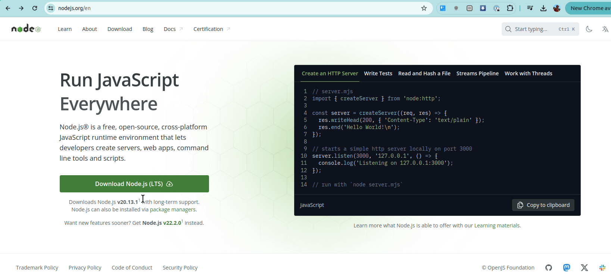
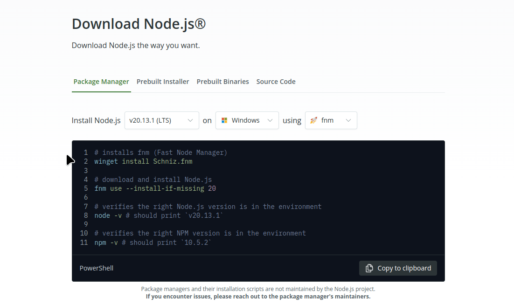

## Pre-requisitos

Tener instalado [VSCode](https://code.visualstudio.com/).

## Wollok Command Line Interface: vía Node

:::note[Versión recomendada]
Esta es la forma recomendada de instalar el CLI en tu entorno, por ser la variante más simple y además por tener optimizaciones que mejoran su performance. Si llegás a tener inconvenientes, podés probar la [instalación alternativa](/website-wollok-ts/getting_started/installation_alternative).
:::

### Windows

Instalar la versión 20 de Node desde [el link oficial](https://nodejs.org/en) haciendo click en la opción "Download Node.js (LTS)". Luego ejecutás el instalador y seleccionás Next dejando todas las opciones por defecto. En caso de dudas te recomendamos que veas [este tutorial](https://www.youtube.com/watch?v=29mihvA_zEA71)

Si la versión oficial no es la 20 en el momento en el que quieras descargarte el instalador, podés ir a [esta ventana](https://nodejs.org/en/download/package-manager) y allí seleccionar la última versión 20 de Node para tu sistema operativo. Una vez realizado este paso, te va a mostrar cómo es el mecanismo de instalación.



Verifiquemos que tenemos node instalado en nuestro sistema, desde cualquier carpeta abrimos la terminal que puede ser Powershell, la línea de comandos CMD o Git Bash:

```bash
node -v
# te debe devolver el número de versión 20.x.y
```

También deberíamos tener `npm` (el manejador de paquetes de Node) instalado:

```bash
npm -v
# te debe devolver el número de versión
```

Ahora sí, instalamos wollok haciendo

```bash
npm i -g wollok-ts-cli
```

Verificamos que tenemos instalado Wollok CLI. En la terminal escribimos:

```zsh
wollok --version
```


:::note[Sobre la versión]
La versión que muestre será la última que te hayas descargado (no tiene que ser 0.2.2)
:::

### Linux

Instalar la versión 20 de Node desde [este link](https://nodejs.org/en/download/package-manager). La opción más simple es que uses **nvm** (Node Version Manager), un ejecutable que te permite manejar diferentes versiones de Node en tu máquina local. Seleccioná la última versión que aparezca para Node 20, el sistema operativo Linux y la variante nvm.


Verifiquemos que tenemos node instalado en nuestro sistema, desde cualquier carpeta abrimos una terminal con `Ctrl` + `Alt` + `T`:

```bash
node -v
# te debe devolver el número de versión 20.x.y
```

También deberíamos tener `npm` (el manejador de paquetes de Node) instalado:

```bash
npm -v
# te debe devolver el número de versión
```

Ahora sí, instalamos wollok haciendo

```bash
npm i -g wollok-ts-cli
```

Verificamos que tenemos instalado Wollok CLI. En la terminal escribimos:

```zsh
wollok --version
```


:::note[Sobre la versión]
La versión que muestre será la última que te hayas descargado (no tiene que ser 0.2.2)
:::

### Mac

Instalar la versión 20 de Node desde [este link](https://nodejs.org/en/download/package-manager). La opción más simple es que uses **brew** o **nvm** (Node Version Manager), un ejecutable que te permite manejar diferentes versiones de Node en tu máquina local. Seleccioná la última versión que aparezca para Node 20, el sistema operativo Linux y la variante nvm o brew.



Verifiquemos que tenemos node instalado en nuestro sistema, desde cualquier carpeta abrimos una terminal con `⌘ (Cmd) + Espacio` o buscando `Terminal` en el Launchpad:

```bash
node -v
# te debe devolver el número de versión 20.x.y
```

También deberíamos tener `npm` (el manejador de paquetes de Node) instalado:

```bash
npm -v
# te debe devolver el número de versión
```

Ahora sí, instalamos wollok haciendo

```bash
npm i -g wollok-ts-cli
```

Verificamos que tenemos instalado Wollok CLI. En la terminal escribimos:

```zsh
wollok --version
```

:::note[Sobre la versión]
La versión que muestre será la última que te hayas descargado (no tiene que ser 0.2.2)
:::

## Extensiones de Wollok para VSC

Estas instrucciones son independientes del sistema operativo de tu máquina.

1. **Abrir el VSCode**

2. Instalar las extensiones [`wollok-lsp-ide`](https://marketplace.visualstudio.com/items?itemName=uqbar.wollok-lsp-ide) y [`wollok-highlight`](https://marketplace.visualstudio.com/items?itemName=uqbar.wollok-highlight) disponibles en los links o directamente desde el _Marketplace_ del VSCode. El orden en el que instales las extensiones es indistinto.

Podés ir a la tab de Extensiones, buscar 'wollok' e instalarlas como muestra esta imagen:


3. Si todo salió bien deberías poder ver ambas extensiones instaladas en tu VSCode:


## Configuración

Ahora es necesario **configurar la extensión** para que pueda usar _Wollok-CLI_ para correr programas.

1. Ir a la pestaña de "ajustes" (o "settings" en inglés) del VSCode: `Ctrl + ,` o desde el menú: `Code -> Preferencias -> Ajustes`. Y buscar por `wollok`.

2. El primer ajuste que aparecerá es para indicar el _path_ donde se encuentra Wollok Command Line Interface (CLI). Para eso es necesario 1. utilizar el nombre "wollok" si seguiste los pasos de instalación o bien 2. copiar **la dirección _absoluta_ del ejecutable que te descargaste antes** y pegarlo en el campo.

:::caution[Atención]
Este paso es necesario para poder ejecutar código.
:::

1. También hay otras configuraciones, como seleccionar el idioma en que querés que se muestren los mensajes de errores.

2. Al final debería verse algo así:


**¡Listo!**

Ya deberías poder usar VSCode con Wollok.


## Próximos pasos


¿Cómo seguimos?

- Podés ver cómo [crear un proyecto Wollok de cero](/website-wollok-ts/getting_started/new_project).
- Si ya tenés un proyecto Wollok en tu VSCode te recomendamos hacer el [Tour por las herramientas que soportamos](/website-wollok-ts/tour/console) para sacarle todo el potencial al IDE.
- Si tenés dudas sobre algo del lenguaje podés [ir a la documentación](/website-wollok-ts/documentation/introduction).
