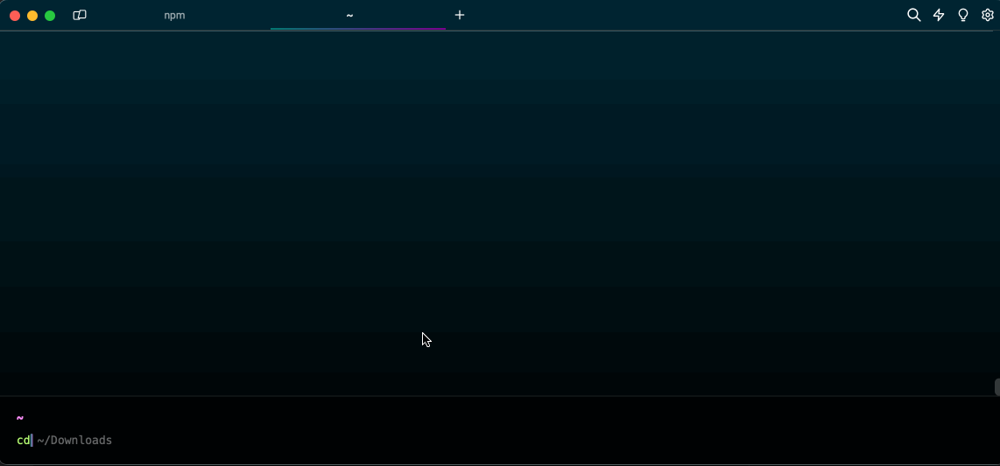

## Pre-requisitos

Tener instalado [VSCode](https://code.visualstudio.com/).

## Wollok Command Line Interface

> A partir de aquí vamos a necesitar levantar una terminal zsh, podés usar la terminal por defecto de Mac o cualquier otro programa como [Warp](https://www.warp.dev/)

1. Descargar la _Wollok Command Line Interface_ (CLI) disponible para [Linux](https://github.com/uqbar-project/wollok-ts-cli/releases/latest/download/wollok-ts-cli-linux-x64), [MacOS](https://github.com/uqbar-project/wollok-ts-cli/releases/latest/download/wollok-ts-cli-macos-x64) (versión [arm64](https://github.com/uqbar-project/wollok-ts-cli/releases/latest/download/wollok-ts-cli-macos-arm64)) y [Windows](https://github.com/uqbar-project/wollok-ts-cli/releases/latest/download/wollok-ts-cli-win-x64.exe).

2. Luego vamos a **renombrar el ejecutable** a wollok (o wollok.exe) para facilitar su uso desde una terminal y **lo ubicaremos dentro del PATH de nuestro sistema operativo** para que lo reconozca desde cualquier carpeta. A continuación te dejamos las instrucciones para cada caso.

### Windows

[Windows](https://medium.com/@kevinmarkvi/how-to-add-executables-to-your-path-in-windows-5ffa4ce61a53))

### Linux

[Linux](https://unix.stackexchange.com/questions/183295/adding-programs-to-path)

### Mac

- Asumimos que descargaste la versión del cli en la carpeta `~/Downloads` (`~` es la carpeta raíz del usuario logueado). Desde aquí vamos a renombrar el archivo ejecutable y le vamos a dar permisos de ejecución:



Los comandos que ejecutamos son

```bash
cd ~/Downloads
ls -la wollok*                # tiene que aparecer el archivo que descargaste
mv ./wollok-ts-cli* ./wollok  # renombramos el archivo (tiene que haber uno solo)
chmod a+x ./wollok            # permisos de ejecución
ls -la wollok                 # confirmamos que tiene permisos bien configurados
                              #  deben ser algo como -rwxr-xr-x (revisar las x)
```

Ahora viene la parte más molesta: Mac introduce un chequeo de seguridad especial, por lo que vas a tener que

- ejecutar `wollok --version` la primera vez
- va a aparecer una ventana avisando que no puede ejecutarlo, y hacemos click en la opción `Show in Finder`
- desde el Finder hacemos click derecho y en las opciones, nuevamente Open
- eso abre una Terminal (en nuestro caso no es la que estamos usando, por eso aparece una nueva ventana), y una **nueva ventana de confirmación**. Esta vez en lugar de `Show in Finder` seleccionamos `Open`
- la parte buena es que una vez que ejecuta desde esa terminal, ya podemos utilizarlo normalmente, podemos volver a nuestra terminal original
- volvemos a ejecutar `wollok --version` y ya funciona correctamente


## Extensiones de Wollok

1. **Abrir el VSCode**

2. Instalar las extensiones [`wollok-lsp-ide`](https://marketplace.visualstudio.com/items?itemName=uqbar.wollok-lsp-ide) y [`wollok-highlight`](https://marketplace.visualstudio.com/items?itemName=uqbar.wollok-highlight) disponibles en los links o directamente desde el _Marketplace_ del VSCode.

Podés ir a la tab de Extensiones, buscar 'wollok' e instalarlas como muestra esta imagen:


3. Si todo salió bien deberías poder ver ambas extensiones instaladas en tu VSCode:


## Configuración

Ahora es necesario **configurar la extensión** para que pueda usar _Wollok-CLI_ para correr programas.

1. Ir a la pestaña de "ajustes" (o "settings" en inglés) del VSCode: `Ctrl + ,` o desde el menú: `Code -> Preferencias -> Ajustes`. Y buscar por `wollok`.

2. El primer ajuste que aparecerá es para indicar el _path_ donde se encuentra Wollok Command Line Interface (CLI). Para eso es necesario 1. utilizar el nombre "wollok" si seguiste los pasos de instalación o bien 2. copiar **la dirección _absoluta_ del ejecutable que te descargaste antes** y pegarlo en el campo.

> ATENCIÓN ⚠️
> Este paso es necesario para poder ejecutar código.

3. También hay otras configuraciones, como seleccionar el idioma en que querés que se muestren los mensajes de errores.

4. Al final debería verse algo así:


**¡Listo!**

Ya deberías poder usar VSCode con Wollok.


## Próximos pasos


¿Cómo seguimos?

- Podés ver cómo [crear un proyecto Wollok de cero](/website-wollok-ts/getting_started/new_project).
- Si ya tenés un proyecto Wollok en tu VSCode te recomendamos hacer el [Tour por las herramientas que soportamos](/website-wollok-ts/tour) para sacarle todo el potencial al IDE.
- Si tenés dudas sobre algo del lenguaje podés [ir a la documentación](/website-wollok-ts/documentation).
