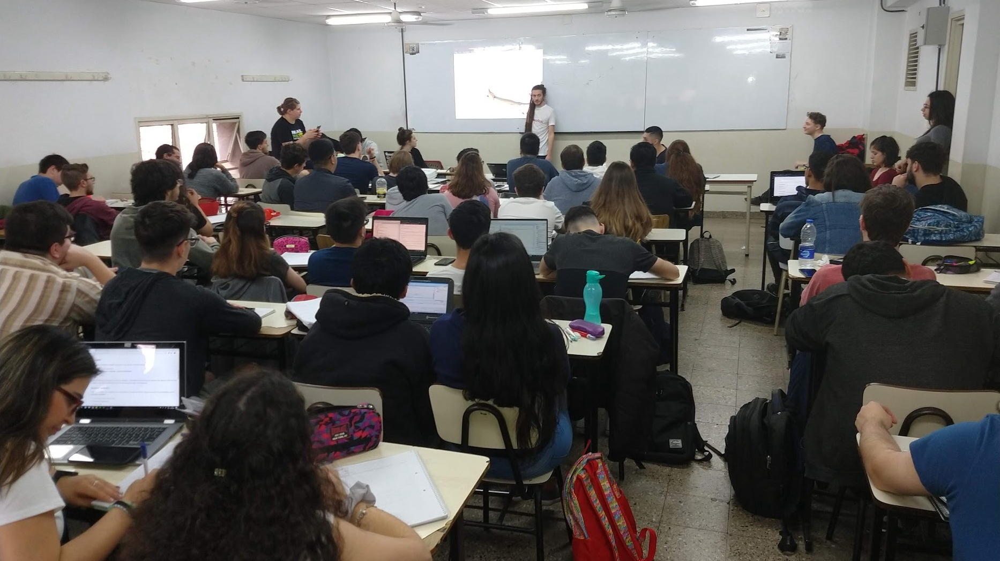

import { LinkCard } from '@astrojs/starlight/components';

## Somos un grupo de docentes, ingenierxs e investigadorxs

Tenemos por objetivo promover el desarrollo de la educación en informática para favorecer el acceso inclusivo al conocimiento y las innovaciones tecnológicas.

|  |  |
|---|---|
|  |  |

Hace varios años decidimos juntarnos bajo el nombre de **Uqbar**, en honor a [un cuento de Borges](https://es.wikipedia.org/wiki/Tl%C3%B6n,_Uqbar,_Orbis_Tertius).

<LinkCard
  title="Visitá el sitio de Uqbar"
  description="Podés ver todos nuestros proyectos y conocernos mejor."
  href="https://uqbar.org/"
  target="blank"
/>