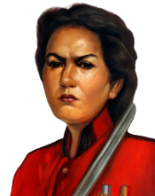

import { LinkCard } from '@astrojs/starlight/components';

## Wollok 3.0

La última versión de Wollok se llama [Juana Azurduy](https://es.wikipedia.org/wiki/Juana_Azurduy) en honor al mariscal de la independencia del Alto Perú (honrada tanto en Bolivia como en Argentina).

<LinkCard
  title="Mirá los cambios que trae"
  description="En el CHANGELOG del lenguage podés ver los cambios que hubo entre versiones."
  href="https://github.com/uqbar-project/wollok-language/blob/master/CHANGELOG.md"
  target="blank"
/>